<!--
 * @Author: LetMeFly
 * @Date: 2024-05-15 17:45:43
 * @LastEditors: LetMeFly
 * @LastEditTime: 2024-07-07 13:45:52
-->
# FLDefinder

联邦学习 ViT Backdoor防御的研究。

+ 进度地址：[人工智能 - 联邦学习(安全性) - 自用(ProjectDoing)](https://blog.letmefly.xyz/2024/01/06/Other-AI-FL-FederatedLearning-ProjectWritingIn1month/)
+ 分支[try0_poolAndExtra](https://github.com/LetMeFly666/FLDefinder/tree/try0_poolAndExtra)：因准确率太低，研究一半而Archive的分支
+ 分支[try1_changeFromPelta](https://github.com/LetMeFly666/FLDefinder/tree/try1_changeFromPelta)：在[Pelta](https://github.com/queyrusi/Pelta)的代码上修改，但其代码中似乎无FL相关部分，研究一半而Archive的分支

## Log

### Log001 - 2024.5.14-2024.5.19

暂时停止在[原有](https://github.com/LetMeFly666/FLDefinder/commit/c830b55950ba84a8dd657bbd4ecfa247c6c3e8a5)基础上继续更改，开始寻找现有的联邦学习ViT Backdoor的代码并在此基础上进行更改。

+ <del>搜索关键词：<code>("ViT" OR "Vision Transformer") AND "Backdoor" AND ("Federated Learning" OR "FL") AND "github.com"</code>（这样Sensitivity也会被检索上）</del>
+ 搜索关键词：```"Vision Transformer" AND "Backdoor" AND ("Federated Learning" OR "FL") AND "github.com"```

确认文章[^1]。下载其[代码](https://github.com/queyrusi/Pelta)与[数据集](https://www.kaggle.com/datasets/reyacardov/ensemblemodels)尝试开始运行。

### Log003 - 2024.5.19-2024.5.23

1. 修改代码文件结构成功跑通
2. 重命名```env```文件为更加通用（标准）的```.env```
3. 实现了自定义的```print```函数，在调用```initPrint```函数后，以后的所有```print```都会在原来的基础上同时往initPrint时的文件中输出一份。

但是此时调用的一些库的Warning不是调用print函数显示到终端的，就无法同时悄悄地写入到文件中一份。

### Log004 - 2024.7.2_17:00-2024.7.2_23:50

1. 先将“FL”、“ViT”的代码跑通，首先拥有一个能在半小时内训练出大约90%多准确率的ViT联邦学习框架。

先支持大约5个客户端即可。

实际上到```2024.7.3 23:59```左右才实现。

### Log005 - 2024.7.4_9:00-2024.7.4_23:59

1. 优化模型（包括调整learning rate，优化数据分发方式，调整训练集大小等）。结果：lr```0.001略优于0.0025优于0.01```且```0.001略优于0.0005```。基本可以确定```0.001```是一个比较合适的值。
2. 融入攻防。

今晚走之前跑上两个长训练。

+ lr=0.001，epoch=50x3，maxAcc=57.37%
+ lr=0.005，epoch=50x3，maxAcc=54.03%
+ ~~lr=0.01，epoch=60x1，maxAcc=48.17%~~
+ lr=0.01，epoch=200x3，maxAcc=60.13%
+ lr=0.01，epoch=50x3，maxAcc=51.37%
+ lr=0.02，epoch=200x3，Adam+StepLR，maxAcc=29.60%（后面想起来每次下发模型优化器都会重置）

### Log006 - 2024.7.5_9:00-2024.7.5_11:00

暂不使用非预训练模型，先使用预训练模型，将参数调整到一个不错的状态。

| lr     | epoch | dataPerEpoch | maxAcc  | timeConsume | 备注           |
|--------|-------|--------------|---------|-------------|----------------|
| 0.001  | 30x1  | 10x32        | 96.9%   | 165s        |                |
| 0.0001 | 30x1  | 10x32        | 95.8%   | 164s        |                |
| 0.0001 | 60x1  | 10x32        | 97.6%   | 319s        |                |
| 0.0001 | 150x1 | 10x32        | 98.8%   | 790s        | 116轮首次达到  |
| 0.001  | 150x1 | 10x32        | 98.9%   | 808s        | 71轮首次达到   |
| 0.001  | 1300x1| 10x32        | 99.5%   | 7099s       | 1141轮首次达到 |
| 0.02   | 1300x1| 10x32        | 99.7%   | 7433s       | 570轮首次达到  |

其中：

+ lr：步长（学习率）
+ epoch=30x1：服务器主持训练30轮，每轮每个客户端训练1轮
+ dataPerEpoch=10x32：10个客户端，每个客户端每次训练下发32个训练数据

### Log007 - 2024.7.5_13:30-2024.7.5_18:00

+ 成功融入最基础的梯度上升攻击与PCA检测的防御

使用的是内置的PCA算法，PCA偏离倍数为```0.1```和```0.3```时都不如```0.2```时。因此选择偏离倍数为```0.2```

当恶意用户的攻击方式是梯度乘以-2时，几乎都能正常识别；当梯度乘以-1时，识别准确率为```68.75%```。而前10轮次的识别准确率为```90%```。这可能是由“接近饱和时梯度变化变小”导致的。

**但是：** PCA直接计算十个客户端的所有参数（1×n）太慢了。

然后我把攻击者设置为2/10个，PCA就寄了。攻击力度为1的话（梯度×-1）基本上是在瞎输出，攻击力度为2的话基本上每次能在两个里面抓到一个。

| 攻击者 | 攻击力度 | PCA的偏离倍数 | 表现                        |
|--------|----------|---------------|-----------------------------|
| 2/10   | 1        | 2             | 基本上在瞎输出              |
| 2/10   | 2        | 2             | 基本上每次能在两个里面抓到一个 |
| 2/10   | 2        | 1             | 32次中有31次完全正确，另外一次多抓了一个 |
| 3/10   | 2        | 1             | 32次中有8次完全正确，21次少抓了一个，3次少抓了两个|
| 3/10   | 1        | 1             | 32次中有10次完全正确，9次少抓了一个，2次少抓了两个<br/>1次少一多一，5次少两且多一，5次少三多一|

### Log008 - 2024.7.5_20:40-2024.7.6_0:30

+ 先写上题目和摘要（要做什么事情）
+ 之后是Intro和Related Work

结果刚配置好了VsCode、overleaf(byr)、中文: [c3db3c](https://github.com/LetMeFly666/FLDefinder/tree/c3db3c6865d9a9b1cac8016fe2fadb6a3c2fbc05)

### Log009 - 2024.7.6_9:10-2024.7.6_13:40

PCA及其参数相关实验。

#### PCA的n_components参数

一个实验大约需要15分钟

不变参数：

```python
num_clients = 10          # 客户端数量
batch_size = 32           # 每批次多少张图片
num_rounds = 32           # 总轮次
epoch_client = 1          # 每个客户端的轮次
datasize_perclient = 32   # 每个客户端的数据量
datasize_valide = 1000    # 测试集大小
learning_rate = 0.001     # 步长
ifPCA = True              # 是否启用PCA评价 
ifCleanAnoma = True       # 是否清理PCA抓出的异常数据
PCA_rate = 1              # PCA偏离倍数
attackList = [0, 1, 2]    # 恶意客户端下标
attack_rate = 1           # 攻击强度
```

变化部分：

```python
[PCA_nComponents for PCA_nComponents in [0.95, 0.8, 0.6, 0.4, 0.2, 1, 2, 3, 4, 10]]
```

结果：

| 攻击者 | 攻击力度 | PCA的偏离倍数 | PCA降维后的主成分数目 | 表现 |
|---|---|---|---|---|
| 3/10 | 1 | 1 | 0.95 | 32次中有：7次完全正确，12次少抓1个，5次少抓2个，5次少抓2个多抓1个，2次少抓3个多抓1个，1次少抓3个多抓2个 <br/>[((3, 0), 7), ((2, 0), 12), ((1, 0), 5), ((1, 1), 5), ((0, 1), 2), ((0, 2), 1)] |
| 3/10 | 1 | 1 | 0.8 | 32次中有：4次完全正确，5次少抓1个，9次少抓2个，3次少抓1个多抓1个，4次少抓2个多抓1个，7次少抓3个多抓1个 <br/>[((3, 0), 4), ((2, 0), 5), ((1, 0), 9), ((2, 1), 3), ((1, 1), 4), ((0, 1), 7)] |
| 3/10 | 1 | 1 | 0.6 | 32次中有：6次完全正确，7次少抓1个，5次少抓2个，1次少抓1个多抓1个，6次少抓2个多抓1个，5次少抓3个多抓1个，1次少抓2个多抓2个，1次少抓3个多抓2个 <br/>[((3, 0), 6), ((2, 0), 7), ((1, 0), 5), ((2, 1), 1), ((1, 1), 6), ((0, 1), 5), ((1, 2), 1), ((0, 2), 1)] |
| 3/10 | 1 | 1 | 0.4 | 32次中有：10次完全正确，10次少抓1个，2次少抓2个，1次多抓1个，3次少抓1个多抓1个，3次少抓2个多抓1个，3次少抓3个多抓1个 <br/>[((3, 0), 10), ((2, 0), 10), ((1, 0), 2), ((3, 1), 1), ((2, 1), 3), ((1, 1), 3), ((0, 1), 3)] |
| 3/10 | 1 | 1 | 0.2 | 32次中有：19次完全正确，10次少抓1个，2次少抓2个，1次少抓3个多抓1个 <br/>[((3, 0), 19), ((2, 0), 10), ((1, 0), 2), ((0, 1), 1)] |
| 3/10 | 1 | 1 | 1 | 32次中有：17次完全正确，11次少抓1个，3次少抓2个，1次少抓3个多抓1个 <br/>[((3, 0), 17), ((2, 0), 11), ((1, 0), 3), ((0, 1), 1)] |
| 3/10 | 1 | 1 | 2 | 32次中有：5次完全正确，10次少抓1个，3次少抓2个，7次少抓1个多抓1个，6次少抓2个多抓1个，1次少抓3个多抓1个 <br/>[((3, 0), 5), ((2, 0), 10), ((1, 0), 3), ((2, 1), 7), ((1, 1), 6), ((0, 1), 1)] |
| 3/10 | 1 | 1 | 4 | 32次中有：2次完全正确，8次少抓1个，5次少抓2个，4次少抓1个多抓1个，6次少抓2个多抓1个，7次少抓3个多抓1个 <br/>[((3, 0), 2), ((2, 0), 8), ((1, 0), 5), ((2, 1), 4), ((1, 1), 6), ((0, 1), 7)] |
| 3/10 | 1 | 1 | 10 | 32次中有：14次完全正确，9次少抓1个，2次少抓2个，1次少抓1个多抓1个，2次少抓2个多抓1个，3次少抓3个多抓1个，1次少抓3个多抓2个 <br/>[((3, 0), 14), ((2, 0), 9), ((1, 0), 2), ((2, 1), 1), ((1, 1), 2), ((0, 1), 3), ((0, 2), 1)] |

n_compose为2、3、4的时候训练好慢，不知道是因为此时有别人在跑其他进程还是什么原因。

### Log010 - 2024.7.6_16:30-2024.7.6_18:40

+ 完成MATLAB大作业。速速完成好了。

### Log010 - 2024.7.6_19:30-2024.7.7_0:45

+ 对比了一下PCA抓恶意用户时恶意用户占比的情况
+ 写了点摘要，尝试写参考文献
+ 尝试了一下非预训练模型能否在较短的时间内突破60%的准确率

#### PCA的恶意客户端占比与PCA效果实验

不变参数：

```python
num_clients = 10
batch_size = 32
num_rounds = 32
epoch_client = 1
datasize_perclient = 32
datasize_valide = 1000
learning_rate = 0.001
ifPCA = True
ifCleanAnoma = True
PCA_rate = 1
PCA_nComponents = 0.2
attack_rate = 1
device = cuda:0
```

变化参数：AttackLists

| 攻击者 | 攻击力度 | PCA的偏离倍数 | PCA降维后的主成分数目 | 表现 |
|---|---|---|---|---| 
| 0/10 | 1 | 1 | 0.2 | 32次中有：12次多抓1个，19次多抓2个，1次多抓3个 <br/>[((0, 1), 12), ((0, 2), 19), ((0, 3), 1)] |
| 1/10 | 1 | 1 | 0.2 | 32次中有：18次完全正确，9次多抓1个，4次少抓1个多抓1个，1次少抓1个多抓2个 <br/>[((1, 0), 18), ((1, 1), 9), ((0, 1), 4), ((0, 2), 1)] |
| 2/10 | 1 | 1 | 0.2 | 32次中有：26次完全正确，3次少抓1个，1次少抓1个多抓1个，2次少抓2个多抓1个 <br/>[((2, 0), 26), ((1, 0), 3), ((1, 1), 1), ((0, 1), 2)] |
| 3/10 | 1 | 1 | 0.2 | 32次中有：19次完全正确，7次少抓1个，1次少抓2个，4次少抓1个多抓1个，1次少抓3个多抓1个 <br/>[((3, 0), 19), ((2, 0), 7), ((1, 0), 1), ((2, 1), 4), ((0, 1), 1)] |

可以看到当前参数下攻击者数量在20%左右时效果最佳。

#### 使用非预训练模型进行训练之模型调参

不变的配置信息如下：

```python

```

模型参数相关参数：

| 单个客户端训练轮次 | learning rate | batch size | device | accuracy | 最大准确率 | 最大准确率的首次出现轮次 | 程序执行耗时 | 结果图 |
| --- | --- | --- | --- | --- | --- | --- | --- | --- |
| 3 | 0.5 | 32 | cuda:0 | <div style='overflow-x:auto;width:120px;height:30px;'>19.2%, 22.1%, 24.3%, 27.3%, 27.7%, 28.0%, 27.9%, 28.5%, 29.8%, 32.7%, 33.7%, 32.9%, 33.8%, 33.4%, 35.9%, 37.1%, 37.3%, 38.6%, 39.7%, 40.5%, 39.3%, 39.0%, 40.1%, 40.2%, 39.2%, 40.5%, 45.6%, 41.8%, 43.6%, 40.0%, 42.9%, 44.8%</div> | 45.6% | 27 | 0:19:22 |  |
| 3 | 0.1 | 32 | cuda:0 | <div style='overflow-x:auto;width:120px;height:30px;'>19.7%, 24.4%, 24.7%, 24.8%, 27.4%, 30.3%, 26.3%, 28.5%, 27.9%, 30.8%, 31.7%, 31.5%, 32.8%, 35.8%, 36.4%, 34.3%, 34.5%, 37.4%, 41.7%, 42.8%, 39.5%, 42.3%, 43.9%, 39.8%, 40.6%, 44.7%, 45.1%, 47.0%, 45.8%, 46.3%, 44.7%, 46.4%</div> | 47.0% | 28 | 0:19:47 | 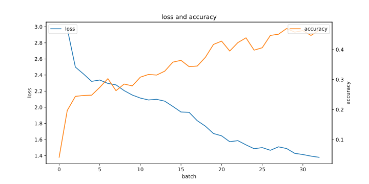 |
| 3 | 0.05 | 32 | cuda:0 | <div style='overflow-x:auto;width:120px;height:30px;'>25.1%, 22.8%, 27.3%, 25.8%, 25.0%, 28.8%, 30.4%, 27.4%, 30.6%, 31.8%, 33.1%, 33.9%, 35.2%, 40.7%, 34.9%, 37.0%, 39.1%, 40.2%, 40.3%, 37.2%, 40.6%, 40.0%, 40.0%, 41.1%, 42.6%, 44.0%, 40.1%, 45.5%, 45.6%, 41.5%, 44.4%, 45.5%</div> | 45.6% | 29 | 0:31:10 | 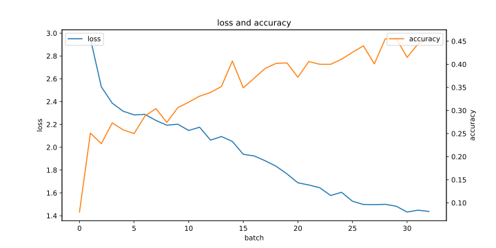 |
| 3 | 0.01 | 32 | cuda:0 | <div style='overflow-x:auto;width:120px;height:30px;'>20.5%, 24.5%, 22.2%, 27.8%, 27.4%, 29.4%, 29.8%, 31.0%, 29.6%, 33.7%, 31.8%, 33.2%, 33.1%, 34.7%, 37.1%, 35.1%, 36.2%, 36.3%, 40.3%, 39.0%, 39.1%, 43.3%, 41.4%, 43.1%, 40.8%, 44.7%, 43.9%, 41.1%, 39.8%, 42.8%, 45.6%, 43.4%</div> | 45.6% | 31 | 0:25:25 | 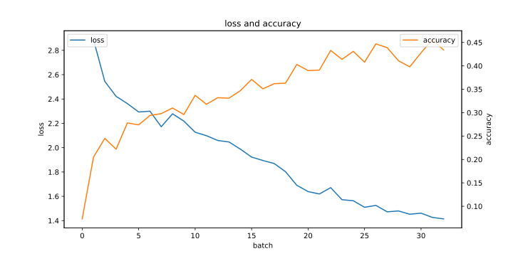 |
| 3 | 0.005 | 32 | cuda:0 | <div style='overflow-x:auto;width:120px;height:30px;'>20.6%, 24.1%, 29.6%, 25.6%, 26.3%, 25.7%, 30.4%, 31.5%, 31.1%, 33.4%, 32.1%, 32.3%, 32.0%, 33.8%, 35.6%, 36.6%, 36.9%, 38.5%, 39.1%, 38.6%, 39.5%, 42.6%, 42.4%, 43.9%, 42.1%, 46.1%, 43.6%, 44.1%, 46.9%, 44.9%, 47.0%, 44.8%</div> | 47.0% | 31 | 0:25:38 | 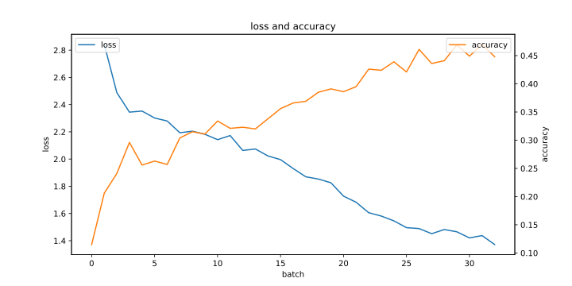 |
| 3 | 0.001 | 32 | cuda:0 | <div style='overflow-x:auto;width:120px;height:30px;'>17.1%, 22.9%, 27.6%, 25.7%, 26.5%, 28.7%, 25.8%, 30.3%, 34.0%, 31.1%, 30.6%, 31.0%, 33.3%, 36.7%, 36.3%, 36.0%, 38.3%, 37.5%, 37.1%, 38.0%, 40.7%, 40.0%, 39.9%, 41.4%, 42.9%, 43.4%, 43.0%, 44.4%, 45.6%, 45.8%, 46.0%, 45.5%</div> | 46.0% | 31 | 0:25:43 | 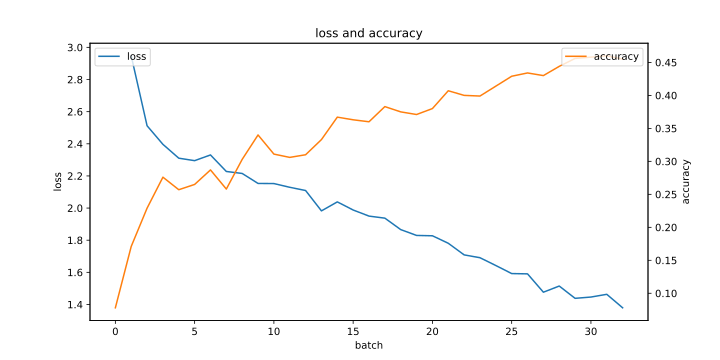 |
| 3 | 0.0001 | 32 | cuda:0 | <div style='overflow-x:auto;width:120px;height:30px;'>22.9%, 27.5%, 26.9%, 23.2%, 26.9%, 30.3%, 27.9%, 31.3%, 28.2%, 28.9%, 32.4%, 34.9%, 31.9%, 35.1%, 38.6%, 37.1%, 38.5%, 38.3%, 39.1%, 38.6%, 38.7%, 40.1%, 40.6%, 43.4%, 46.3%, 41.5%, 40.9%, 43.8%, 40.7%, 43.6%, 42.2%, 42.1%</div> | 46.3% | 25 | 0:30:49 | 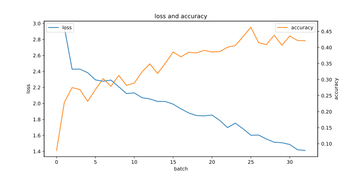 |
| 3 | 0.001 | 32 | cuda:1 | <div style='overflow-x:auto;width:120px;height:30px;'>21.4%, 25.1%, 27.6%, 26.2%, 26.3%, 29.2%, 29.5%, 28.1%, 29.8%, 31.1%, 30.5%, 34.8%, 34.5%, 37.4%, 37.5%, 39.5%, 36.3%, 37.4%, 40.6%, 38.6%, 42.6%, 41.0%, 40.3%, 40.9%, 44.1%, 42.7%, 46.0%, 42.4%, 44.2%, 43.1%, 43.8%, 43.0%</div> | 46.0% | 27 | 0:39:19 | 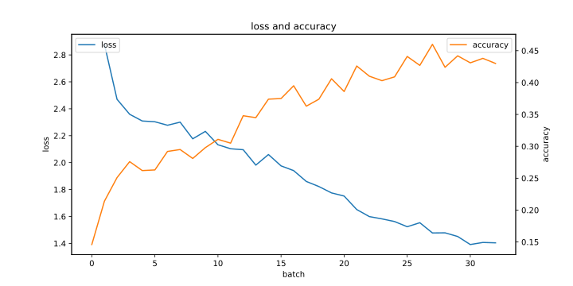 |
| 3 | 0.001 | 16 | cuda:1 | <div style='overflow-x:auto;width:120px;height:30px;'>16.3%, 17.9%, 24.6%, 25.7%, 28.7%, 28.7%, 29.4%, 31.3%, 33.0%, 35.4%, 36.0%, 35.3%, 32.4%, 36.2%, 38.4%, 36.6%, 40.4%, 40.6%, 40.8%, 40.0%, 41.1%, 42.6%, 42.7%, 40.7%, 43.2%, 44.1%, 42.5%, 44.6%, 42.7%, 45.6%, 46.3%, 41.8%</div> | 46.3% | 31 | 0:28:20 | 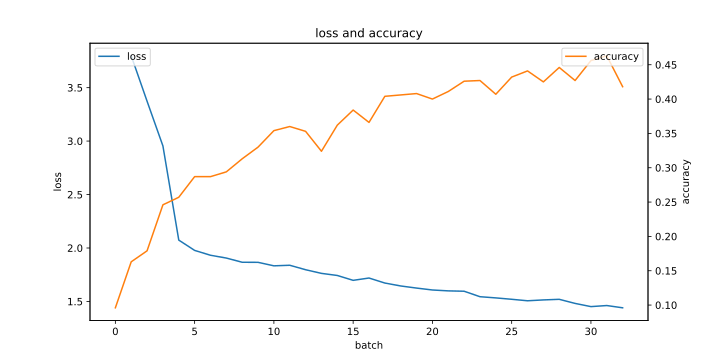 |
| 3 | 0.001 | 8 | cuda:1 | <div style='overflow-x:auto;width:120px;height:30px;'>11.5%, 13.3%, 22.5%, 23.1%, 24.5%, 27.6%, 27.6%, 28.3%, 28.7%, 30.9%, 32.2%, 31.6%, 34.8%, 35.5%, 33.9%, 34.1%, 33.0%, 35.7%, 36.9%, 39.1%, 37.5%, 37.6%, 41.3%, 35.8%, 40.2%, 38.4%, 38.3%, 40.4%, 41.2%, 42.7%, 41.1%, 42.6%</div> | 42.7% | 30 | 0:41:27 | 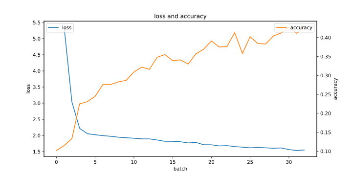 |
| 2 | 0.001 | 32 | cuda:1 | <div style='overflow-x:auto;width:120px;height:30px;'>18.8%, 25.4%, 26.5%, 23.9%, 29.7%, 27.9%, 29.4%, 26.9%, 30.3%, 33.4%, 31.5%, 32.8%, 30.2%, 29.5%, 30.8%, 31.5%, 34.1%, 36.0%, 35.8%, 35.5%, 34.4%, 38.5%, 37.7%, 39.0%, 36.1%, 36.8%, 38.7%, 33.6%, 37.8%, 39.1%, 40.7%, 39.5%</div> | 40.7% | 31 | 0:16:39 | 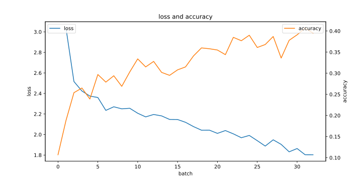 |
| 2 | 0.001 | 8 | cuda:1 | <div style='overflow-x:auto;width:120px;height:30px;'>16.6%, 20.6%, 23.3%, 25.3%, 28.8%, 26.9%, 26.2%, 27.1%, 30.9%, 29.8%, 32.1%, 32.7%, 33.8%, 31.1%, 34.7%, 36.0%, 35.1%, 37.0%, 36.8%, 34.5%, 36.7%, 36.5%, 37.4%, 38.4%, 37.7%, 37.3%, 40.4%, 39.6%, 39.4%, 38.3%, 40.2%, 39.6%</div> | 40.4% | 27 | 0:26:43 | 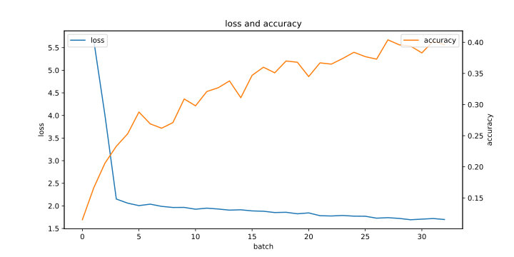 |
| 1 | 0.001 | 32 | cuda:1 | <div style='overflow-x:auto;width:120px;height:30px;'>19.9%, 22.2%, 24.3%, 25.6%, 27.1%, 25.7%, 26.1%, 26.3%, 25.6%, 27.3%, 29.2%, 30.0%, 28.0%, 28.3%, 29.9%, 30.9%, 28.5%, 31.1%, 31.8%, 28.4%, 34.3%, 31.4%, 36.1%, 35.2%, 30.6%, 35.3%, 33.0%, 37.2%, 36.4%, 32.1%, 37.4%, 38.9%</div> | 38.9% | 32 | 0:12:44 | 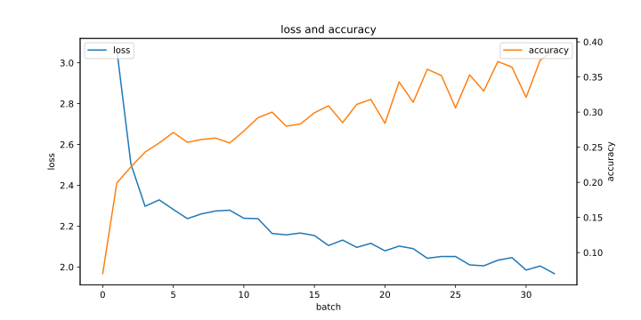 |
| 1 | 0.001 | 8 | cuda:1 | <div style='overflow-x:auto;width:120px;height:30px;'>18.1%, 18.8%, 20.0%, 23.4%, 21.7%, 24.7%, 24.6%, 24.3%, 24.8%, 26.1%, 25.6%, 29.2%, 28.0%, 24.3%, 28.4%, 31.0%, 29.9%, 31.4%, 31.9%, 28.6%, 29.9%, 33.8%, 31.2%, 34.9%, 29.9%, 31.7%, 31.4%, 35.9%, 35.7%, 32.7%, 35.5%, 36.4%</div> | 36.4% | 32 | 0:16:48 | 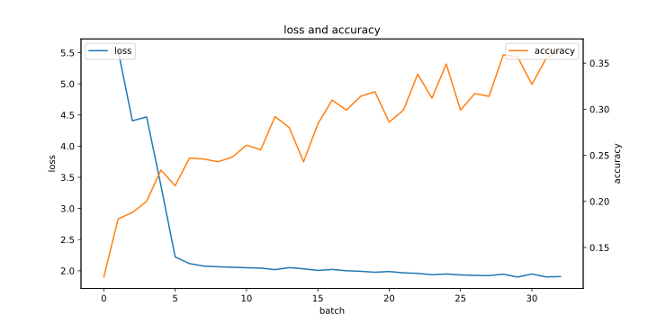 |

可能是因训练轮次太少了，都暂未达到较高的准确率

### TODO

- [x] 每个客户端下次数据会发生变化
- [x] 客户端本地训练多个（例如3）epoch
- [x] 没有攻击者时若参数中启用PCA也要尝试抓人，因为服务器不知道有没有攻击者
- [ ] 先写个题目和摘要
- [ ] IF零信任？
- [ ] IF恶意用户检测之-检测此次梯度时参考历史梯度？
- [ ] 了解一些攻防手段，例如主成分萃取/最大池化及其关系
- [ ] （暂时抛弃）难道是泛用的ViT模型不知道Cifar-10只有10个输出所以准确率一直在50%多徘徊？（非预训练）
- [ ] （暂时抛弃）不上传客户端的diff，而是直接上传所有客户端的参数然后在服务端求平均
- [ ] （暂时抛弃）损失函数求模型总的损失函数

## End

The End.
