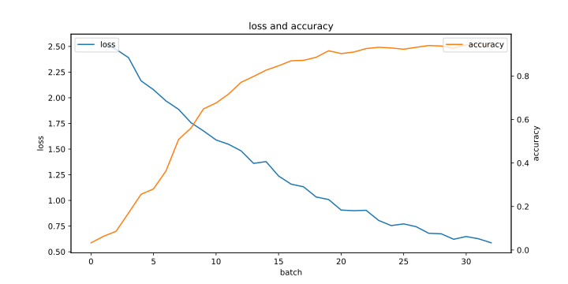

<!--
 * @Author: LetMeFly
 * @Date: 2024-05-15 17:45:43
 * @LastEditors: LetMeFly
 * @LastEditTime: 2024-07-16 11:13:11
-->
# ViT-MGI

联邦学习 ViT Backdoor防御的研究。

+ 进度地址：[人工智能 - 联邦学习(安全性) - 自用(ProjectDoing)](https://blog.letmefly.xyz/2024/01/06/Other-AI-FL-FederatedLearning-ProjectWritingIn1month/)
+ 分支[try0_poolAndExtra](https://github.com/LetMeFly666/ViT-MGI/tree/try0_poolAndExtra)：因准确率太低，研究一半而Archive的分支
+ 分支[try1_changeFromPelta](https://github.com/LetMeFly666/ViT-MGI/tree/try1_changeFromPelta)：在[Pelta](https://github.com/queyrusi/Pelta)的代码上修改，但其代码中似乎无FL相关部分，研究一半而Archive的分支

## Log

### Log001 - 2024.5.14-2024.5.19

暂时停止在[原有](https://github.com/LetMeFly666/ViT-MGI/commit/c830b55950ba84a8dd657bbd4ecfa247c6c3e8a5)基础上继续更改，开始寻找现有的联邦学习ViT Backdoor的代码并在此基础上进行更改。

+ <del>搜索关键词：<code>("ViT" OR "Vision Transformer") AND "Backdoor" AND ("Federated Learning" OR "FL") AND "github.com"</code>（这样Sensitivity也会被检索上）</del>
+ 搜索关键词：```"Vision Transformer" AND "Backdoor" AND ("Federated Learning" OR "FL") AND "github.com"```

确认文章[^1]。下载其[代码](https://github.com/queyrusi/Pelta)与[数据集](https://www.kaggle.com/datasets/reyacardov/ensemblemodels)尝试开始运行。

### Log003 - 2024.5.19-2024.5.23

1. 修改代码文件结构成功跑通
2. 重命名```env```文件为更加通用（标准）的```.env```
3. 实现了自定义的```print```函数，在调用```initPrint```函数后，以后的所有```print```都会在原来的基础上同时往initPrint时的文件中输出一份。

但是此时调用的一些库的Warning不是调用print函数显示到终端的，就无法同时悄悄地写入到文件中一份。

### Log004 - 2024.7.2_17:00-2024.7.2_23:50

1. 先将“FL”、“ViT”的代码跑通，首先拥有一个能在半小时内训练出大约90%多准确率的ViT联邦学习框架。

先支持大约5个客户端即可。

实际上到```2024.7.3 23:59```左右才实现。

### Log005 - 2024.7.4_9:00-2024.7.4_23:59

1. 优化模型（包括调整learning rate，优化数据分发方式，调整训练集大小等）。结果：lr```0.001略优于0.0025优于0.01```且```0.001略优于0.0005```。基本可以确定```0.001```是一个比较合适的值。
2. 融入攻防。

今晚走之前跑上两个长训练。

+ lr=0.001，epoch=50x3，maxAcc=57.37%
+ lr=0.005，epoch=50x3，maxAcc=54.03%
+ ~~lr=0.01，epoch=60x1，maxAcc=48.17%~~
+ lr=0.01，epoch=200x3，maxAcc=60.13%
+ lr=0.01，epoch=50x3，maxAcc=51.37%
+ lr=0.02，epoch=200x3，Adam+StepLR，maxAcc=29.60%（后面想起来每次下发模型优化器都会重置）

### Log006 - 2024.7.5_9:00-2024.7.5_11:00

暂不使用非预训练模型，先使用预训练模型，将参数调整到一个不错的状态。

| lr     | epoch | dataPerEpoch | maxAcc  | timeConsume | 备注           |
|--------|-------|--------------|---------|-------------|----------------|
| 0.001  | 30x1  | 10x32        | 96.9%   | 165s        |                |
| 0.0001 | 30x1  | 10x32        | 95.8%   | 164s        |                |
| 0.0001 | 60x1  | 10x32        | 97.6%   | 319s        |                |
| 0.0001 | 150x1 | 10x32        | 98.8%   | 790s        | 116轮首次达到  |
| 0.001  | 150x1 | 10x32        | 98.9%   | 808s        | 71轮首次达到   |
| 0.001  | 1300x1| 10x32        | 99.5%   | 7099s       | 1141轮首次达到 |
| 0.02   | 1300x1| 10x32        | 99.7%   | 7433s       | 570轮首次达到  |

其中：

+ lr：步长（学习率）
+ epoch=30x1：服务器主持训练30轮，每轮每个客户端训练1轮
+ dataPerEpoch=10x32：10个客户端，每个客户端每次训练下发32个训练数据

### Log007 - 2024.7.5_13:30-2024.7.5_18:00

+ 成功融入最基础的梯度上升攻击与PCA检测的防御

使用的是内置的PCA算法，PCA偏离倍数为```0.1```和```0.3```时都不如```0.2```时。因此选择偏离倍数为```0.2```

当恶意用户的攻击方式是梯度乘以-2时，几乎都能正常识别；当梯度乘以-1时，识别准确率为```68.75%```。而前10轮次的识别准确率为```90%```。这可能是由“接近饱和时梯度变化变小”导致的。

**但是：** PCA直接计算十个客户端的所有参数（1×n）太慢了。

然后我把攻击者设置为2/10个，PCA就寄了。攻击力度为1的话（梯度×-1）基本上是在瞎输出，攻击力度为2的话基本上每次能在两个里面抓到一个。

| 攻击者 | 攻击力度 | PCA的偏离倍数 | 表现                        |
|--------|----------|---------------|-----------------------------|
| 2/10   | 1        | 2             | 基本上在瞎输出              |
| 2/10   | 2        | 2             | 基本上每次能在两个里面抓到一个 |
| 2/10   | 2        | 1             | 32次中有31次完全正确，另外一次多抓了一个 |
| 3/10   | 2        | 1             | 32次中有8次完全正确，21次少抓了一个，3次少抓了两个|
| 3/10   | 1        | 1             | 32次中有10次完全正确，9次少抓了一个，2次少抓了两个<br/>1次少一多一，5次少两且多一，5次少三多一|

### Log008 - 2024.7.5_20:40-2024.7.6_0:30

+ 先写上题目和摘要（要做什么事情）
+ 之后是Intro和Related Work

结果刚配置好了VsCode、overleaf(byr)、中文: [c3db3c](https://github.com/LetMeFly666/ViT-MGI/tree/c3db3c6865d9a9b1cac8016fe2fadb6a3c2fbc05)

### Log009 - 2024.7.6_9:10-2024.7.6_13:40

PCA及其参数相关实验。

#### PCA的n_components参数

一个实验大约需要15分钟

不变参数：

```python
num_clients = 10          # 客户端数量
batch_size = 32           # 每批次多少张图片
num_rounds = 32           # 总轮次
epoch_client = 1          # 每个客户端的轮次
datasize_perclient = 32   # 每个客户端的数据量
datasize_valide = 1000    # 测试集大小
learning_rate = 0.001     # 步长
ifPCA = True              # 是否启用PCA评价 
ifCleanAnoma = True       # 是否清理PCA抓出的异常数据
PCA_rate = 1              # PCA偏离倍数
attackList = [0, 1, 2]    # 恶意客户端下标
attack_rate = 1           # 攻击强度
```

变化部分：

```python
[PCA_nComponents for PCA_nComponents in [0.95, 0.8, 0.6, 0.4, 0.2, 1, 2, 3, 4, 10]]
```

结果：

| 攻击者 | 攻击力度 | PCA的偏离倍数 | PCA降维后的主成分数目 | 表现 |
|---|---|---|---|---|
| 3/10 | 1 | 1 | 0.95 | 32次中有：7次完全正确，12次少抓1个，5次少抓2个，5次少抓2个多抓1个，2次少抓3个多抓1个，1次少抓3个多抓2个 <br/>[((3, 0), 7), ((2, 0), 12), ((1, 0), 5), ((1, 1), 5), ((0, 1), 2), ((0, 2), 1)] |
| 3/10 | 1 | 1 | 0.8 | 32次中有：4次完全正确，5次少抓1个，9次少抓2个，3次少抓1个多抓1个，4次少抓2个多抓1个，7次少抓3个多抓1个 <br/>[((3, 0), 4), ((2, 0), 5), ((1, 0), 9), ((2, 1), 3), ((1, 1), 4), ((0, 1), 7)] |
| 3/10 | 1 | 1 | 0.6 | 32次中有：6次完全正确，7次少抓1个，5次少抓2个，1次少抓1个多抓1个，6次少抓2个多抓1个，5次少抓3个多抓1个，1次少抓2个多抓2个，1次少抓3个多抓2个 <br/>[((3, 0), 6), ((2, 0), 7), ((1, 0), 5), ((2, 1), 1), ((1, 1), 6), ((0, 1), 5), ((1, 2), 1), ((0, 2), 1)] |
| 3/10 | 1 | 1 | 0.4 | 32次中有：10次完全正确，10次少抓1个，2次少抓2个，1次多抓1个，3次少抓1个多抓1个，3次少抓2个多抓1个，3次少抓3个多抓1个 <br/>[((3, 0), 10), ((2, 0), 10), ((1, 0), 2), ((3, 1), 1), ((2, 1), 3), ((1, 1), 3), ((0, 1), 3)] |
| 3/10 | 1 | 1 | 0.2 | 32次中有：19次完全正确，10次少抓1个，2次少抓2个，1次少抓3个多抓1个 <br/>[((3, 0), 19), ((2, 0), 10), ((1, 0), 2), ((0, 1), 1)] |
| 3/10 | 1 | 1 | 1 | 32次中有：17次完全正确，11次少抓1个，3次少抓2个，1次少抓3个多抓1个 <br/>[((3, 0), 17), ((2, 0), 11), ((1, 0), 3), ((0, 1), 1)] |
| 3/10 | 1 | 1 | 2 | 32次中有：5次完全正确，10次少抓1个，3次少抓2个，7次少抓1个多抓1个，6次少抓2个多抓1个，1次少抓3个多抓1个 <br/>[((3, 0), 5), ((2, 0), 10), ((1, 0), 3), ((2, 1), 7), ((1, 1), 6), ((0, 1), 1)] |
| 3/10 | 1 | 1 | 4 | 32次中有：2次完全正确，8次少抓1个，5次少抓2个，4次少抓1个多抓1个，6次少抓2个多抓1个，7次少抓3个多抓1个 <br/>[((3, 0), 2), ((2, 0), 8), ((1, 0), 5), ((2, 1), 4), ((1, 1), 6), ((0, 1), 7)] |
| 3/10 | 1 | 1 | 10 | 32次中有：14次完全正确，9次少抓1个，2次少抓2个，1次少抓1个多抓1个，2次少抓2个多抓1个，3次少抓3个多抓1个，1次少抓3个多抓2个 <br/>[((3, 0), 14), ((2, 0), 9), ((1, 0), 2), ((2, 1), 1), ((1, 1), 2), ((0, 1), 3), ((0, 2), 1)] |

n_compose为2、3、4的时候训练好慢，不知道是因为此时有别人在跑其他进程还是什么原因。

### Log010 - 2024.7.6_16:30-2024.7.6_18:40

+ 完成MATLAB大作业。速速完成好了。

### Log011 - 2024.7.6_19:30-2024.7.7_0:45

+ 对比了一下PCA抓恶意用户时恶意用户占比的情况
+ 写了点摘要，尝试写参考文献
+ 尝试了一下非预训练模型能否在较短的时间内突破60%的准确率

#### PCA的恶意客户端占比与PCA效果实验

不变参数：

```python
num_clients = 10
batch_size = 32
num_rounds = 32
epoch_client = 1
datasize_perclient = 32
datasize_valide = 1000
learning_rate = 0.001
ifPCA = True
ifCleanAnoma = True
PCA_rate = 1
PCA_nComponents = 0.2
attack_rate = 1
device = cuda:0
```

变化参数：AttackLists

| 攻击者 | 攻击力度 | PCA的偏离倍数 | PCA降维后的主成分数目 | 表现 |
|---|---|---|---|---| 
| 0/10 | 1 | 1 | 0.2 | 32次中有：12次多抓1个，19次多抓2个，1次多抓3个 <br/>[((0, 1), 12), ((0, 2), 19), ((0, 3), 1)] |
| 1/10 | 1 | 1 | 0.2 | 32次中有：18次完全正确，9次多抓1个，4次少抓1个多抓1个，1次少抓1个多抓2个 <br/>[((1, 0), 18), ((1, 1), 9), ((0, 1), 4), ((0, 2), 1)] |
| 2/10 | 1 | 1 | 0.2 | 32次中有：26次完全正确，3次少抓1个，1次少抓1个多抓1个，2次少抓2个多抓1个 <br/>[((2, 0), 26), ((1, 0), 3), ((1, 1), 1), ((0, 1), 2)] |
| 3/10 | 1 | 1 | 0.2 | 32次中有：19次完全正确，7次少抓1个，1次少抓2个，4次少抓1个多抓1个，1次少抓3个多抓1个 <br/>[((3, 0), 19), ((2, 0), 7), ((1, 0), 1), ((2, 1), 4), ((0, 1), 1)] |

可以看到当前参数下攻击者数量在20%左右时效果最佳。

#### 使用非预训练模型进行训练之模型调参

不变的配置信息如下：

```python
num_clients = 10
num_rounds = 32
datasize_perclient = 32
datasize_valide = 1000
ifPCA = False
ifCleanAnoma = True
PCA_rate = 1
PCA_nComponents = 2
attackList = []
attack_rate = 1
```

模型参数相关参数：

| 单个客户端训练轮次 | 步长 | batch size | device | accuracy | 最大准确率 | 首次出现轮次 | 执行耗时 | 结果图 |
| --- | --- | --- | --- | --- | --- | --- | --- | --- |
| 3 | 0.5 | 32 | cuda:0 | [准确率](./result/Archive001-oldHistory/Archive005-nonePretrainedModel-params/2024.07.07-02:27:51/accuracyList.txt) | 45.6% | 27 | 0:19:22 |  |
| 3 | 0.1 | 32 | cuda:0 | [准确率](./result/Archive001-oldHistory/Archive005-nonePretrainedModel-params/2024.07.07-01:52:45/accuracyList.txt) | 47.0% | 28 | 0:19:47 |  |
| 3 | 0.05 | 32 | cuda:0 | [准确率](./result/Archive001-oldHistory/Archive005-nonePretrainedModel-params/2024.07.07-01:16:58/accuracyList.txt) | 45.6% | 29 | 0:31:10 |  |
| 3 | 0.01 | 32 | cuda:0 | [准确率](./result/Archive001-oldHistory/Archive005-nonePretrainedModel-params/2024.07.07-00:41:37/accuracyList.txt) | 45.6% | 31 | 0:25:25 |  |
| 3 | 0.005 | 32 | cuda:0 | [准确率](./result/Archive001-oldHistory/Archive005-nonePretrainedModel-params/2024.07.07-03:02:27/accuracyList.txt) | 47.0% | 31 | 0:25:38 |  |
| 3 | 0.001 | 32 | cuda:0 | [准确率](./result/Archive001-oldHistory/Archive005-nonePretrainedModel-params/2024.07.07-03:36:50/accuracyList.txt) | 46.0% | 31 | 0:25:43 |  |
| 3 | 0.0001 | 32 | cuda:0 | [准确率](./result/Archive001-oldHistory/Archive005-nonePretrainedModel-params/2024.07.07-04:11:19/accuracyList.txt) | 46.3% | 25 | 0:30:49 |  |
| 3 | 0.001 | 32 | cuda:1 | [准确率](./result/Archive001-oldHistory/Archive005-nonePretrainedModel-params/2024.07.07-00:44:26/accuracyList.txt) | 46.0% | 27 | 0:39:19 |  |
| 3 | 0.001 | 16 | cuda:1 | [准确率](./result/Archive001-oldHistory/Archive005-nonePretrainedModel-params/2024.07.07-02:08:37/accuracyList.txt) | 46.3% | 31 | 0:28:20 |  |
| 3 | 0.001 | 8 | cuda:1 | [准确率](./result/Archive001-oldHistory/Archive005-nonePretrainedModel-params/2024.07.07-02:54:05/accuracyList.txt) | 42.7% | 30 | 0:41:27 |  |
| 2 | 0.001 | 32 | cuda:1 | [准确率](./result/Archive001-oldHistory/Archive005-nonePretrainedModel-params/2024.07.07-01:25:06/accuracyList.txt) | 40.7% | 31 | 0:16:39 |  |
| 2 | 0.001 | 8 | cuda:1 | [准确率](./result/Archive001-oldHistory/Archive005-nonePretrainedModel-params/2024.07.07-03:41:48/accuracyList.txt) | 40.4% | 27 | 0:26:43 |  |
| 1 | 0.001 | 32 | cuda:1 | [准确率](./result/Archive001-oldHistory/Archive005-nonePretrainedModel-params/2024.07.07-01:53:18/accuracyList.txt) | 38.9% | 32 | 0:12:44 |  |
| 1 | 0.001 | 8 | cuda:1 | [准确率](./result/Archive001-oldHistory/Archive005-nonePretrainedModel-params/2024.07.07-04:14:49/accuracyList.txt) | 36.4% | 32 | 0:16:48 |  |

可能是因训练轮次太少了，都暂未达到较高的准确率

### Log012 - 2024.7.7_8:00-2024.7.7_11:30(ty)

+ 池化相关研究
+ 隔离森林相关研究

#### 关于池化的研究

池化size：4

+ 实验[`2024.07.07-09:28:37-pool`](https://github.com/LetMeFly666/ViT-MGI/tree/d8de1dcf1b20063607f8bfbf91810072b2ca9a1e/result/Archive001-oldHistory/Archive006-poolAndForest/2024.07.07-09:28:37-pool/stdout.txt)：抓人准确率下降，最高准确率略高
+ 实验[`2024.07.07-09:29:04-notpool`](https://github.com/LetMeFly666/ViT-MGI/tree/d8de1dcf1b20063607f8bfbf91810072b2ca9a1e/result/Archive001-oldHistory/Archive006-poolAndForest/2024.07.07-09:29:04-notpool/stdout.txt)：抓人准确率较高，最高准确率略低

似乎效果并不明显。

池化size：9，池化方式：mean

+ 实验[`2024.07.07-10:14:39`](https://github.com/LetMeFly666/ViT-MGI/tree/d8de1dcf1b20063607f8bfbf91810072b2ca9a1e/result/Archive001-oldHistory/Archive006-poolAndForest/2024.07.07-10:14:39/stdout.txt)：对比notpool，抓人准确率下降，最高准确率无优势

#### 关于隔离森林的研究

几乎是在瞎抓。不过基本上都是mean池。

### Log013 - 2024.7.7_12:0-2024.7.7_16:30

+ 数据整理与(小幅度)重构

### Log014 - 2024.7.7_17:30-2024.7.7_18:15

+ 压了一根超五类网线，在实验室也用上了千兆网

### Log015 - 2024.7.7_22:00-2024.7.7_23:59

+ 写Latex
+ 最大池化实验

不得不说，虽然池化的效果仍有待商榷，但是PCA识别起来真的快太多了！

### Log016 - 2024.7.8_10:30-2024.7.8_23:59

+ 今日务必先将Abstract、Introduction和Related Work写完
+ 整理了昨晚的“是否池化以及池化size以及检测方式的实验”的实验结果

以下实验中，不变量为：

```python
num_clients = 10
batch_size = 32
num_rounds = 32
epoch_client = 1
datasize_perclient = 32
datasize_valide = 1000
learning_rate = 0.001
ifFindAttack = True
ifCleanAnoma = True
PCA_rate = 1
PCA_nComponents = 0.2
attackList = [0, 1]
attack_rate = 1
pooltype = Max
ifPretrained = True
device = cuda:0
```

<details><summary>实验命令</summary>

```bash
python main.py --ifPooling=True --pooltype=Max --poolsize=4 --ifPCA=True
python main.py --ifPooling=True --pooltype=Max --poolsize=4 --ifPCA=True
python main.py --ifPooling=True --pooltype=Max --poolsize=4 --ifPCA=True
python main.py --ifPooling=True --pooltype=Max --poolsize=9 --ifPCA=True
python main.py --ifPooling=True --pooltype=Max --poolsize=9 --ifPCA=True
python main.py --ifPooling=True --pooltype=Max --poolsize=9 --ifPCA=True
python main.py --ifPooling=True --pooltype=Max --poolsize=16 --ifPCA=True
python main.py --ifPooling=True --pooltype=Max --poolsize=16 --ifPCA=True
python main.py --ifPooling=True --pooltype=Max --poolsize=16 --ifPCA=True
python main.py --ifPooling=True --pooltype=Max --poolsize=25 --ifPCA=True
python main.py --ifPooling=True --pooltype=Max --poolsize=25 --ifPCA=True
python main.py --ifPooling=True --pooltype=Max --poolsize=25 --ifPCA=True

python main.py --ifPooling=False --pooltype=Max --poolsize=4 --ifPCA=True
python main.py --ifPooling=False --pooltype=Max --poolsize=4 --ifPCA=True
python main.py --ifPooling=False --pooltype=Max --poolsize=4 --ifPCA=True
python main.py --ifPooling=False --pooltype=Max --poolsize=9 --ifPCA=True
python main.py --ifPooling=False --pooltype=Max --poolsize=9 --ifPCA=True
python main.py --ifPooling=False --pooltype=Max --poolsize=9 --ifPCA=True
python main.py --ifPooling=False --pooltype=Max --poolsize=16 --ifPCA=True
python main.py --ifPooling=False --pooltype=Max --poolsize=16 --ifPCA=True
python main.py --ifPooling=False --pooltype=Max --poolsize=16 --ifPCA=True
python main.py --ifPooling=False --pooltype=Max --poolsize=25 --ifPCA=True
python main.py --ifPooling=False --pooltype=Max --poolsize=25 --ifPCA=True
python main.py --ifPooling=False --pooltype=Max --poolsize=25 --ifPCA=True

python main.py --ifPooling=True --pooltype=Max --poolsize=4 --ifPCA=False
python main.py --ifPooling=True --pooltype=Max --poolsize=4 --ifPCA=False
python main.py --ifPooling=True --pooltype=Max --poolsize=4 --ifPCA=False
python main.py --ifPooling=True --pooltype=Max --poolsize=9 --ifPCA=False
python main.py --ifPooling=True --pooltype=Max --poolsize=9 --ifPCA=False
python main.py --ifPooling=True --pooltype=Max --poolsize=9 --ifPCA=False
python main.py --ifPooling=True --pooltype=Max --poolsize=16 --ifPCA=False
python main.py --ifPooling=True --pooltype=Max --poolsize=16 --ifPCA=False
python main.py --ifPooling=True --pooltype=Max --poolsize=16 --ifPCA=False
python main.py --ifPooling=True --pooltype=Max --poolsize=25 --ifPCA=False
python main.py --ifPooling=True --pooltype=Max --poolsize=25 --ifPCA=False
python main.py --ifPooling=True --pooltype=Max --poolsize=25 --ifPCA=False

python main.py --ifPooling=False --pooltype=Max --poolsize=4 --ifPCA=False
python main.py --ifPooling=False --pooltype=Max --poolsize=4 --ifPCA=False
python main.py --ifPooling=False --pooltype=Max --poolsize=4 --ifPCA=False
python main.py --ifPooling=False --pooltype=Max --poolsize=9 --ifPCA=False
python main.py --ifPooling=False --pooltype=Max --poolsize=9 --ifPCA=False
python main.py --ifPooling=False --pooltype=Max --poolsize=9 --ifPCA=False
python main.py --ifPooling=False --pooltype=Max --poolsize=16 --ifPCA=False
python main.py --ifPooling=False --pooltype=Max --poolsize=16 --ifPCA=False
python main.py --ifPooling=False --pooltype=Max --poolsize=16 --ifPCA=False
python main.py --ifPooling=False --pooltype=Max --poolsize=25 --ifPCA=False
python main.py --ifPooling=False --pooltype=Max --poolsize=25 --ifPCA=False
python main.py --ifPooling=False --pooltype=Max --poolsize=25 --ifPCA=False
```

</details>

实验结果如下：

| 是否池化 | pool size | 检测方式 | 检测结果 | accuracy | 最大准确率 | 首次出现轮次 | 执行耗时 | 结果图 |
| --- | --- | --- | --- | --- | --- | --- | --- | --- |
| True | 2 * 2 | PCA | 32次中有：12次完全正确，4次少抓1个，1次多抓1个，4次少抓1个多抓1个，7次少抓2个多抓1个，2次少抓1个多抓2个，2次少抓2个多抓2个 | [准确率](./result/Archive001-oldHistory/Archive007-poolSizeAndPCAorForest/2024.07.08-00:01:53/accuracyList.txt) | 96.2% | 31 | 0:08:21 |  |
| True | 2 * 2 | PCA | 32次中有：7次完全正确，4次少抓1个，4次多抓1个，7次少抓1个多抓1个，9次少抓2个多抓1个，1次少抓1个多抓2个 | [准确率](./result/Archive001-oldHistory/Archive007-poolSizeAndPCAorForest/2024.07.08-00:10:15/accuracyList.txt) | 95.5% | 32 | 0:07:50 |  |
| True | 2 * 2 | PCA | 32次中有：8次完全正确，3次少抓1个，5次多抓1个，12次少抓1个多抓1个，4次少抓2个多抓1个 | [准确率](./result/Archive001-oldHistory/Archive007-poolSizeAndPCAorForest/2024.07.08-00:18:07/accuracyList.txt) | 96.7% | 31 | 0:07:44 |  |
| True | 3 * 3 | PCA | 32次中有：2次完全正确，7次少抓1个，3次多抓1个，10次少抓1个多抓1个，10次少抓2个多抓1个 | [准确率](./result/Archive001-oldHistory/Archive007-poolSizeAndPCAorForest/2024.07.08-00:25:52/accuracyList.txt) | 95.4% | 27 | 0:06:38 |  |
| True | 3 * 3 | PCA | 32次中有：2次完全正确，5次少抓1个，2次多抓1个，7次少抓1个多抓1个，5次少抓2个多抓1个，3次少抓1个多抓2个，8次少抓2个多抓2个 | [准确率](./result/Archive001-oldHistory/Archive007-poolSizeAndPCAorForest/2024.07.08-00:32:31/accuracyList.txt) | 94.7% | 31 | 0:06:37 |  |
| True | 3 * 3 | PCA | 32次中有：2次完全正确，5次少抓1个，5次多抓1个，4次少抓1个多抓1个，11次少抓2个多抓1个，5次少抓2个多抓2个 | [准确率](./result/Archive001-oldHistory/Archive007-poolSizeAndPCAorForest/2024.07.08-00:39:10/accuracyList.txt) | 95.6% | 32 | 0:06:44 |  |
| True | 4 * 4 | PCA | 32次中有：1次完全正确，6次少抓1个，7次少抓1个多抓1个，9次少抓2个多抓1个，4次少抓1个多抓2个，5次少抓2个多抓2个 | [准确率](./result/Archive001-oldHistory/Archive007-poolSizeAndPCAorForest/2024.07.08-00:56:47/accuracyList.txt) | 94.9% | 32 | 0:05:25 |  |
| True | 4 * 4 | PCA | 32次中有：1次完全正确，5次少抓1个，1次多抓1个，6次少抓1个多抓1个，9次少抓2个多抓1个，9次少抓2个多抓2个，1次少抓2个多抓3个 | [准确率](./result/Archive001-oldHistory/Archive007-poolSizeAndPCAorForest/2024.07.08-00:51:22/accuracyList.txt) | 93.2% | 32 | 0:05:24 |  |
| True | 4 * 4 | PCA | 32次中有：1次完全正确，6次少抓1个，5次少抓1个多抓1个，13次少抓2个多抓1个，2次少抓1个多抓2个，5次少抓2个多抓2个 | [准确率](./result/Archive001-oldHistory/Archive007-poolSizeAndPCAorForest/2024.07.08-00:45:55/accuracyList.txt) | 93.9% | 29 | 0:05:26 |  |
| True | 5 * 5 | PCA | 32次中有：1次完全正确，3次少抓1个，5次少抓1个多抓1个，17次少抓2个多抓1个，5次少抓2个多抓2个，1次少抓2个多抓3个 | [准确率](./result/Archive001-oldHistory/Archive007-poolSizeAndPCAorForest/2024.07.08-01:07:25/accuracyList.txt) | 94.8% | 31 | 0:05:12 |  |
| True | 5 * 5 | PCA | 32次中有：1次完全正确，2次少抓1个，11次少抓1个多抓1个，12次少抓2个多抓1个，2次少抓1个多抓2个，4次少抓2个多抓2个 | [准确率](./result/Archive001-oldHistory/Archive007-poolSizeAndPCAorForest/2024.07.08-01:12:38/accuracyList.txt) | 95.4% | 30 | 0:05:10 |  |
| True | 5 * 5 | PCA | 32次中有：4次少抓1个，6次少抓1个多抓1个，13次少抓2个多抓1个，9次少抓2个多抓2个 | [准确率](./result/Archive001-oldHistory/Archive007-poolSizeAndPCAorForest/2024.07.08-01:02:13/accuracyList.txt) | 94.6% | 32 | 0:05:11 |  |
| False | 2 * 2 | PCA | 32次中有：25次完全正确，1次少抓1个，1次多抓1个，3次少抓1个多抓1个，1次少抓2个多抓1个，1次少抓1个多抓2个 | [准确率](./result/Archive001-oldHistory/Archive007-poolSizeAndPCAorForest/2024.07.08-01:17:50/accuracyList.txt) | 96.6% | 30 | 0:15:01 |  |
| False | 2 * 2 | PCA | 32次中有：29次完全正确，1次少抓1个，2次少抓1个多抓1个 | [准确率](./result/Archive001-oldHistory/Archive007-poolSizeAndPCAorForest/2024.07.08-01:32:52/accuracyList.txt) | 96.8% | 23 | 0:15:03 |  |
| False | 2 * 2 | PCA | 32次中有：20次完全正确，7次少抓1个，4次少抓1个多抓1个，1次少抓2个多抓1个 | [准确率](./result/Archive001-oldHistory/Archive007-poolSizeAndPCAorForest/2024.07.08-01:47:56/accuracyList.txt) | 96.2% | 28 | 0:15:04 |  |
| False | 3 * 3 | PCA | 32次中有：25次完全正确，3次少抓1个，1次多抓1个，1次少抓1个多抓1个，1次少抓2个多抓1个，1次少抓2个多抓2个 | [准确率](./result/Archive001-oldHistory/Archive007-poolSizeAndPCAorForest/2024.07.08-02:03:01/accuracyList.txt) | 96.5% | 26 | 0:15:05 |  |
| False | 3 * 3 | PCA | 32次中有：25次完全正确，2次少抓1个，1次少抓1个多抓1个，3次少抓2个多抓1个，1次少抓1个多抓2个 | [准确率](./result/Archive001-oldHistory/Archive007-poolSizeAndPCAorForest/2024.07.08-02:18:07/accuracyList.txt) | 96.2% | 28 | 0:15:05 |  |
| False | 3 * 3 | PCA | 32次中有：25次完全正确，1次少抓1个，1次多抓1个，1次少抓1个多抓1个，4次少抓2个多抓1个 | [准确率](./result/Archive001-oldHistory/Archive007-poolSizeAndPCAorForest/2024.07.08-02:33:13/accuracyList.txt) | 96.4% | 29 | 0:15:00 |  |
| False | 4 * 4 | PCA | 32次中有：22次完全正确，2次少抓1个，1次多抓1个，2次少抓1个多抓1个，5次少抓2个多抓1个 | [准确率](./result/Archive001-oldHistory/Archive007-poolSizeAndPCAorForest/2024.07.08-03:03:19/accuracyList.txt) | 96.1% | 30 | 0:15:23 |  |
| False | 4 * 4 | PCA | 32次中有：24次完全正确，1次少抓1个，2次多抓1个，2次少抓1个多抓1个，3次少抓2个多抓1个 | [准确率](./result/Archive001-oldHistory/Archive007-poolSizeAndPCAorForest/2024.07.08-03:18:43/accuracyList.txt) | 96.0% | 27 | 0:14:58 |  |
| False | 4 * 4 | PCA | 32次中有：25次完全正确，3次少抓1个，1次多抓1个，1次少抓1个多抓1个，2次少抓2个多抓1个 | [准确率](./result/Archive001-oldHistory/Archive007-poolSizeAndPCAorForest/2024.07.08-02:48:14/accuracyList.txt) | 96.9% | 32 | 0:15:04 |  |
| False | 5 * 5 | PCA | 32次中有：28次完全正确，2次少抓1个，1次少抓1个多抓1个，1次少抓2个多抓1个 | [准确率](./result/Archive001-oldHistory/Archive007-poolSizeAndPCAorForest/2024.07.08-03:48:48/accuracyList.txt) | 96.4% | 30 | 0:15:00 |  |
| False | 5 * 5 | PCA | 32次中有：26次完全正确，5次少抓1个，1次少抓1个多抓1个 | [准确率](./result/Archive001-oldHistory/Archive007-poolSizeAndPCAorForest/2024.07.08-03:33:42/accuracyList.txt) | 96.3% | 31 | 0:15:05 |  |
| False | 5 * 5 | PCA | 32次中有：28次完全正确，2次多抓1个，1次少抓1个多抓1个，1次少抓2个多抓1个 | [准确率](./result/Archive001-oldHistory/Archive007-poolSizeAndPCAorForest/2024.07.08-04:03:49/accuracyList.txt) | 96.1% | 32 | 0:15:02 |  |
| True | 2 * 2 | Isolation Forest | 32次中有：1次完全正确，7次少抓1个，7次少抓2个，5次少抓1个多抓1个，11次少抓2个多抓1个，1次少抓1个多抓2个 | [准确率](./result/Archive001-oldHistory/Archive007-poolSizeAndPCAorForest/2024.07.08-04:36:56/accuracyList.txt) | 93.5% | 28 | 0:08:58 |  |
| True | 2 * 2 | Isolation Forest | 32次中有：3次少抓1个，5次少抓2个，6次少抓1个多抓1个，10次少抓2个多抓1个，2次少抓1个多抓2个，4次少抓2个多抓2个，2次少抓2个多抓3个 | [准确率](./result/Archive001-oldHistory/Archive007-poolSizeAndPCAorForest/2024.07.08-04:18:52/accuracyList.txt) | 93.9% | 30 | 0:09:03 |  |
| True | 2 * 2 | Isolation Forest | 32次中有：3次完全正确，5次少抓1个，6次少抓2个，7次少抓1个多抓1个，9次少抓2个多抓1个，1次少抓1个多抓2个，1次少抓2个多抓2个 | [准确率](./result/Archive001-oldHistory/Archive007-poolSizeAndPCAorForest/2024.07.08-04:27:56/accuracyList.txt) | 93.5% | 31 | 0:08:59 |  |
| True | 3 * 3 | Isolation Forest | 32次中有：6次少抓1个，7次少抓2个，2次少抓1个多抓1个，12次少抓2个多抓1个，2次少抓1个多抓2个，3次少抓2个多抓2个 | [准确率](./result/Archive001-oldHistory/Archive007-poolSizeAndPCAorForest/2024.07.08-05:00:14/accuracyList.txt) | 94.4% | 29 | 0:07:09 |  |
| True | 3 * 3 | Isolation Forest | 32次中有：4次少抓1个，11次少抓2个，5次少抓1个多抓1个，10次少抓2个多抓1个，1次少抓1个多抓2个，1次少抓2个多抓2个 | [准确率](./result/Archive001-oldHistory/Archive007-poolSizeAndPCAorForest/2024.07.08-04:45:55/accuracyList.txt) | 94.2% | 31 | 0:07:07 |  |
| True | 3 * 3 | Isolation Forest | 32次中有：3次少抓1个，4次少抓2个，6次少抓1个多抓1个，11次少抓2个多抓1个，1次多抓2个，1次少抓1个多抓2个，5次少抓2个多抓2个，1次少抓2个多抓3个 | [准确率](./result/Archive001-oldHistory/Archive007-poolSizeAndPCAorForest/2024.07.08-04:53:03/accuracyList.txt) | 93.7% | 28 | 0:07:10 |  |
| True | 4 * 4 | Isolation Forest | 32次中有：4次少抓1个，4次少抓2个，3次少抓1个多抓1个，18次少抓2个多抓1个，1次少抓1个多抓2个，2次少抓2个多抓2个 | [准确率](./result/Archive001-oldHistory/Archive007-poolSizeAndPCAorForest/2024.07.08-05:19:16/accuracyList.txt) | 94.9% | 32 | 0:05:31 |  |
| True | 4 * 4 | Isolation Forest | 32次中有：8次少抓1个，7次少抓2个，2次多抓1个，1次少抓1个多抓1个，12次少抓2个多抓1个，2次少抓2个多抓2个 | [准确率](./result/Archive001-oldHistory/Archive007-poolSizeAndPCAorForest/2024.07.08-05:07:24/accuracyList.txt) | 93.5% | 31 | 0:05:33 |  |
| True | 4 * 4 | Isolation Forest | 32次中有：8次少抓1个，8次少抓2个，2次少抓1个多抓1个，12次少抓2个多抓1个，2次少抓2个多抓2个 | [准确率](./result/Archive001-oldHistory/Archive007-poolSizeAndPCAorForest/2024.07.08-05:12:58/accuracyList.txt) | 94.8% | 30 | 0:06:17 |  |
| True | 5 * 5 | Isolation Forest | 32次中有：7次少抓1个，7次少抓2个，1次多抓1个，1次少抓1个多抓1个，7次少抓2个多抓1个，1次少抓1个多抓2个，7次少抓2个多抓2个，1次少抓2个多抓3个 | [准确率](./result/Archive001-oldHistory/Archive007-poolSizeAndPCAorForest/2024.07.08-05:29:49/accuracyList.txt) | 94.8% | 32 | 0:05:01 |  |
| True | 5 * 5 | Isolation Forest | 32次中有：6次少抓1个，5次少抓2个，5次少抓1个多抓1个，9次少抓2个多抓1个，2次少抓1个多抓2个，4次少抓2个多抓2个，1次少抓2个多抓3个 | [准确率](./result/Archive001-oldHistory/Archive007-poolSizeAndPCAorForest/2024.07.08-05:24:48/accuracyList.txt) | 94.8% | 30 | 0:05:00 |  |
| True | 5 * 5 | Isolation Forest | 32次中有：5次少抓1个，4次少抓2个，7次少抓1个多抓1个，12次少抓2个多抓1个，4次少抓2个多抓2个 | [准确率](./result/Archive001-oldHistory/Archive007-poolSizeAndPCAorForest/2024.07.08-05:34:51/accuracyList.txt) | 93.3% | 30 | 0:05:05 |  |
| False | 2 * 2 | Isolation Forest | 32次中有：1次完全正确，1次少抓1个，4次少抓2个，1次多抓1个，7次少抓1个多抓1个，13次少抓2个多抓1个，1次多抓2个，1次少抓1个多抓2个，2次少抓2个多抓2个，1次少抓2个多抓3个 | [准确率](./result/Archive001-oldHistory/Archive007-poolSizeAndPCAorForest/2024.07.08-05:57:10/accuracyList.txt) | 93.8% | 32 | 0:17:03 |  |
| False | 2 * 2 | Isolation Forest | 32次中有：7次少抓1个，6次少抓2个，2次多抓1个，4次少抓1个多抓1个，8次少抓2个多抓1个，4次少抓2个多抓2个，1次少抓2个多抓3个 | [准确率](./result/Archive001-oldHistory/Archive007-poolSizeAndPCAorForest/2024.07.08-06:14:14/accuracyList.txt) | 94.8% | 32 | 0:17:11 |  |
| False | 2 * 2 | Isolation Forest | 32次中有：1次完全正确，4次少抓1个，7次少抓2个，1次少抓1个多抓1个，14次少抓2个多抓1个，3次少抓1个多抓2个，2次少抓2个多抓2个 | [准确率](./result/Archive001-oldHistory/Archive007-poolSizeAndPCAorForest/2024.07.08-05:39:57/accuracyList.txt) | 95.3% | 31 | 0:17:12 |  |
| False | 3 * 3 | Isolation Forest | 32次中有：2次完全正确，4次少抓1个，7次少抓2个，10次少抓1个多抓1个，7次少抓2个多抓1个，1次少抓1个多抓2个，1次少抓2个多抓2个 | [准确率](./result/Archive001-oldHistory/Archive007-poolSizeAndPCAorForest/2024.07.08-06:48:39/accuracyList.txt) | 94.8% | 32 | 0:17:02 |  |
| False | 3 * 3 | Isolation Forest | 32次中有：1次完全正确，11次少抓1个，1次少抓2个，2次多抓1个，3次少抓1个多抓1个，8次少抓2个多抓1个，1次少抓1个多抓2个，5次少抓2个多抓2个 | [准确率](./result/Archive001-oldHistory/Archive007-poolSizeAndPCAorForest/2024.07.08-06:31:26/accuracyList.txt) | 94.0% | 31 | 0:17:12 |  |
| False | 3 * 3 | Isolation Forest | 32次中有：5次少抓1个，8次少抓2个，4次少抓1个多抓1个，10次少抓2个多抓1个，5次少抓2个多抓2个 | [准确率](./result/Archive001-oldHistory/Archive007-poolSizeAndPCAorForest/2024.07.08-07:05:42/accuracyList.txt) | 94.9% | 32 | 0:17:05 |  |
| False | 4 * 4 | Isolation Forest | 32次中有：6次少抓1个，8次少抓2个，1次多抓1个，3次少抓1个多抓1个，9次少抓2个多抓1个，1次少抓1个多抓2个，4次少抓2个多抓2个 | [准确率](./result/Archive001-oldHistory/Archive007-poolSizeAndPCAorForest/2024.07.08-07:39:54/accuracyList.txt) | 94.0% | 29 | 0:17:09 |  |
| False | 4 * 4 | Isolation Forest | 32次中有：1次完全正确，6次少抓1个，7次少抓2个，3次少抓1个多抓1个，11次少抓2个多抓1个，3次少抓2个多抓2个，1次少抓2个多抓4个 | [准确率](./result/Archive001-oldHistory/Archive007-poolSizeAndPCAorForest/2024.07.08-07:22:48/accuracyList.txt) | 95.4% | 31 | 0:17:05 |  |
| False | 4 * 4 | Isolation Forest | 32次中有：2次完全正确，6次少抓1个，7次少抓2个，6次少抓1个多抓1个，7次少抓2个多抓1个，4次少抓2个多抓2个 | [准确率](./result/Archive001-oldHistory/Archive007-poolSizeAndPCAorForest/2024.07.08-07:57:04/accuracyList.txt) | 93.7% | 30 | 0:17:00 |  |
| False | 5 * 5 | Isolation Forest | 32次中有：8次少抓1个，8次少抓2个，5次少抓1个多抓1个，5次少抓2个多抓1个，1次少抓1个多抓2个，4次少抓2个多抓2个，1次少抓2个多抓3个 | [准确率](./result/Archive001-oldHistory/Archive007-poolSizeAndPCAorForest/2024.07.08-08:14:05/accuracyList.txt) | 94.9% | 29 | 0:17:11 |  |
| False | 5 * 5 | Isolation Forest | 32次中有：2次完全正确，3次少抓1个，8次少抓2个，5次少抓1个多抓1个，13次少抓2个多抓1个，1次少抓2个多抓2个 | [准确率](./result/Archive001-oldHistory/Archive007-poolSizeAndPCAorForest/2024.07.08-08:48:25/accuracyList.txt) | 94.3% | 31 | 0:16:55 |  |
| False | 5 * 5 | Isolation Forest | 32次中有：2次完全正确，8次少抓1个，4次少抓2个，7次少抓1个多抓1个，8次少抓2个多抓1个，3次少抓2个多抓2个 | [准确率](./result/Archive001-oldHistory/Archive007-poolSizeAndPCAorForest/2024.07.08-08:31:17/accuracyList.txt) | 94.6% | 31 | 0:17:06 |  |

坏了，当前实验结果表明：

+ 对于某种检测方法（不论是PCA还是隔离森林），池化能很大程度减少计算耗时，但池化后的检测结构都明显不如不池化的。
+ 隔离森林的检测结果都没有PCA好。

但是：PCA降维后再隔离森林效果还不错。后续可能会写一个手动划分恶意用户的函数。

忽然想到好像也不能那么随意地按倍数手动划分，现在攻击者的隔离森林评分几乎相差不大，但是不排除实际应用中会出现贼逆天的攻击者，一举拉大与其他用户的区别。

然后当前在CPU上进行PCA很耗时也确实是个问题。

### Log017 - 2024.7.9_0:00-2024.7.9_15:30

+ 有关`PCA_nComponents`和`forest_nEstimators`的实验。

攻击检测方法恒为PCA+隔离森林，攻击者占比恒为20%。

<details><summary>实验中的不变量</summary>

```python
num_clients = 10
batch_size = 32
num_rounds = 32
epoch_client = 1
datasize_perclient = 32
datasize_valide = 1000
learning_rate = 0.001
ifPCA = False  # 此时ifPCA=False意思是同时启用PCA和隔离森林（待完善，先这样）
ifFindAttack = True
ifCleanAnoma = True
PCA_rate = 1
attackList = [0, 1]
attack_rate = 1
ifPooling = False
poolsize = 1000
pooltype = Max
ifPretrained = True
device = cuda:0
```

本版本中隔离森林的划分规则为`auto`。

</details>

<details><summary>实验结果(x54)</summary>

| PCA components | forest n estimators | 检测结果 | accuracy | 最大准确率 | 首次出现轮次 | 执行耗时 | 结果图 |
| --- | --- | --- | --- | --- | --- | --- | --- |
| 0.04 | 300 | 32次中有：17次多抓1个，1次少抓1个多抓1个，10次多抓2个，3次多抓3个，1次少抓2个多抓3个 | [准确率](./result/Archive001-oldHistory/Archive008-nComponseAndForestNEstimators/2024.07.09-00:44:08/accuracyList.txt) | 97.3% | 30 | 0:15:11 |  |
| 0.04 | 300 | 32次中有：1次完全正确，16次多抓1个，12次多抓2个，3次多抓3个 | [准确率](./result/Archive001-oldHistory/Archive008-nComponseAndForestNEstimators/2024.07.09-00:59:20/accuracyList.txt) | 96.4% | 28 | 0:15:11 |  |
| 0.04 | 300 | 32次中有：1次完全正确，19次多抓1个，11次多抓2个，1次少抓1个多抓2个 | [准确率](./result/Archive001-oldHistory/Archive008-nComponseAndForestNEstimators/2024.07.09-00:28:55/accuracyList.txt) | 96.1% | 26 | 0:15:12 |  |
| 0.01 | 300 | 32次中有：15次多抓1个，17次多抓2个 | [准确率](./result/Archive001-oldHistory/Archive008-nComponseAndForestNEstimators/2024.07.09-01:45:01/accuracyList.txt) | 96.6% | 28 | 0:15:30 |  |
| 0.01 | 300 | 32次中有：1次完全正确，17次多抓1个，1次少抓1个多抓1个，10次多抓2个，1次少抓1个多抓2个，1次少抓2个多抓2个，1次多抓3个 | [准确率](./result/Archive001-oldHistory/Archive008-nComponseAndForestNEstimators/2024.07.09-01:29:44/accuracyList.txt) | 96.3% | 30 | 0:15:16 |  |
| 0.01 | 300 | 32次中有：19次多抓1个，12次多抓2个，1次少抓1个多抓2个 | [准确率](./result/Archive001-oldHistory/Archive008-nComponseAndForestNEstimators/2024.07.09-01:14:32/accuracyList.txt) | 96.7% | 30 | 0:15:11 |  |
| 0.008 | 300 | 32次中有：15次多抓1个，1次少抓1个多抓1个，15次多抓2个，1次多抓3个 | [准确率](./result/Archive001-oldHistory/Archive008-nComponseAndForestNEstimators/2024.07.09-02:00:32/accuracyList.txt) | 96.5% | 32 | 0:15:10 |  |
| 0.008 | 300 | 32次中有：18次多抓1个，11次多抓2个，1次少抓1个多抓2个，2次少抓2个多抓2个 | [准确率](./result/Archive001-oldHistory/Archive008-nComponseAndForestNEstimators/2024.07.09-02:30:54/accuracyList.txt) | 96.5% | 27 | 0:15:08 |  |
| 0.008 | 300 | 32次中有：1次完全正确，17次多抓1个，14次多抓2个 | [准确率](./result/Archive001-oldHistory/Archive008-nComponseAndForestNEstimators/2024.07.09-02:15:43/accuracyList.txt) | 95.7% | 28 | 0:15:09 |  |
| 0.0016 | 300 | 32次中有：20次多抓1个，10次多抓2个，2次多抓3个 | [准确率](./result/Archive001-oldHistory/Archive008-nComponseAndForestNEstimators/2024.07.09-03:01:11/accuracyList.txt) | 95.9% | 32 | 0:15:11 |  |
| 0.0016 | 300 | 32次中有：1次完全正确，16次多抓1个，13次多抓2个，1次少抓1个多抓2个，1次多抓4个 | [准确率](./result/Archive001-oldHistory/Archive008-nComponseAndForestNEstimators/2024.07.09-02:46:03/accuracyList.txt) | 96.7% | 28 | 0:15:07 |  |
| 0.0016 | 300 | 32次中有：1次完全正确，18次多抓1个，11次多抓2个，1次少抓1个多抓2个，1次多抓3个 | [准确率](./result/Archive001-oldHistory/Archive008-nComponseAndForestNEstimators/2024.07.09-03:16:23/accuracyList.txt) | 96.4% | 30 | 0:15:15 |  |
| 0.00032 | 300 | 32次中有：1次完全正确，11次多抓1个，16次多抓2个，1次少抓1个多抓2个，3次多抓3个 | [准确率](./result/Archive001-oldHistory/Archive008-nComponseAndForestNEstimators/2024.07.09-03:31:39/accuracyList.txt) | 95.7% | 26 | 0:15:10 |  |
| 0.00032 | 300 | 32次中有：2次完全正确，10次多抓1个，17次多抓2个，1次少抓1个多抓2个，1次少抓2个多抓2个，1次多抓3个 | [准确率](./result/Archive001-oldHistory/Archive008-nComponseAndForestNEstimators/2024.07.09-04:01:56/accuracyList.txt) | 96.4% | 31 | 0:15:09 |  |
| 0.00032 | 300 | 32次中有：2次完全正确，15次多抓1个，13次多抓2个，1次少抓2个多抓2个，1次多抓3个 | [准确率](./result/Archive001-oldHistory/Archive008-nComponseAndForestNEstimators/2024.07.09-03:46:50/accuracyList.txt) | 96.1% | 32 | 0:15:05 |  |
| 6.4e-05 | 300 | 32次中有：2次完全正确，14次多抓1个，15次多抓2个，1次少抓2个多抓2个 | [准确率](./result/Archive001-oldHistory/Archive008-nComponseAndForestNEstimators/2024.07.09-04:47:24/accuracyList.txt) | 96.7% | 32 | 0:15:09 |  |
| 6.4e-05 | 300 | 32次中有：1次完全正确，15次多抓1个，15次多抓2个，1次多抓3个 | [准确率](./result/Archive001-oldHistory/Archive008-nComponseAndForestNEstimators/2024.07.09-04:32:14/accuracyList.txt) | 96.8% | 29 | 0:15:09 |  |
| 6.4e-05 | 300 | 32次中有：1次完全正确，15次多抓1个，16次多抓2个 | [准确率](./result/Archive001-oldHistory/Archive008-nComponseAndForestNEstimators/2024.07.09-04:17:06/accuracyList.txt) | 96.5% | 30 | 0:15:07 |  |
| 0.04 | 500 | 32次中有：2次完全正确，15次多抓1个，14次多抓2个，1次多抓3个 | [准确率](./result/Archive001-oldHistory/Archive008-nComponseAndForestNEstimators/2024.07.09-05:33:05/accuracyList.txt) | 96.8% | 30 | 0:15:18 |  |
| 0.04 | 500 | 32次中有：3次完全正确，16次多抓1个，10次多抓2个，3次多抓3个 | [准确率](./result/Archive001-oldHistory/Archive008-nComponseAndForestNEstimators/2024.07.09-05:17:48/accuracyList.txt) | 97.1% | 30 | 0:15:16 |  |
| 0.04 | 500 | 32次中有：13次多抓1个，1次少抓1个多抓1个，16次多抓2个，1次多抓3个，1次少抓2个多抓3个 | [准确率](./result/Archive001-oldHistory/Archive008-nComponseAndForestNEstimators/2024.07.09-05:02:34/accuracyList.txt) | 96.8% | 27 | 0:15:13 |  |
| 0.01 | 500 | 32次中有：1次完全正确，16次多抓1个，14次多抓2个，1次少抓2个多抓3个 | [准确率](./result/Archive001-oldHistory/Archive008-nComponseAndForestNEstimators/2024.07.09-06:03:40/accuracyList.txt) | 96.6% | 31 | 0:15:17 |  |
| 0.01 | 500 | 32次中有：17次多抓1个，1次少抓1个多抓1个，13次多抓2个，1次少抓1个多抓3个 | [准确率](./result/Archive001-oldHistory/Archive008-nComponseAndForestNEstimators/2024.07.09-06:18:58/accuracyList.txt) | 96.3% | 31 | 0:15:16 |  |
| 0.01 | 500 | 32次中有：18次多抓1个，12次多抓2个，1次少抓1个多抓2个，1次少抓2个多抓2个 | [准确率](./result/Archive001-oldHistory/Archive008-nComponseAndForestNEstimators/2024.07.09-05:48:24/accuracyList.txt) | 97.0% | 32 | 0:15:15 |  |
| 0.008 | 500 | 32次中有：17次多抓1个，2次少抓1个多抓1个，10次多抓2个，2次多抓3个，1次少抓2个多抓3个 | [准确率](./result/Archive001-oldHistory/Archive008-nComponseAndForestNEstimators/2024.07.09-06:49:32/accuracyList.txt) | 96.6% | 29 | 0:15:21 |  |
| 0.008 | 500 | 32次中有：1次完全正确，13次多抓1个，1次少抓1个多抓1个，13次多抓2个，3次少抓1个多抓2个，1次多抓3个 | [准确率](./result/Archive001-oldHistory/Archive008-nComponseAndForestNEstimators/2024.07.09-07:04:53/accuracyList.txt) | 96.0% | 27 | 0:15:15 |  |
| 0.008 | 500 | 32次中有：2次完全正确，16次多抓1个，14次多抓2个 | [准确率](./result/Archive001-oldHistory/Archive008-nComponseAndForestNEstimators/2024.07.09-06:34:15/accuracyList.txt) | 96.8% | 31 | 0:15:16 |  |
| 0.0016 | 500 | 32次中有：3次完全正确，18次多抓1个，9次多抓2个，1次少抓2个多抓2个，1次多抓3个 | [准确率](./result/Archive001-oldHistory/Archive008-nComponseAndForestNEstimators/2024.07.09-07:50:42/accuracyList.txt) | 96.3% | 31 | 0:15:14 |  |
| 0.0016 | 500 | 32次中有：1次完全正确，15次多抓1个，16次多抓2个 | [准确率](./result/Archive001-oldHistory/Archive008-nComponseAndForestNEstimators/2024.07.09-07:35:25/accuracyList.txt) | 96.7% | 30 | 0:15:16 |  |
| 0.0016 | 500 | 32次中有：21次多抓1个，11次多抓2个 | [准确率](./result/Archive001-oldHistory/Archive008-nComponseAndForestNEstimators/2024.07.09-07:20:09/accuracyList.txt) | 97.1% | 32 | 0:15:15 |  |
| 0.00032 | 500 | 32次中有：17次多抓1个，15次多抓2个 | [准确率](./result/Archive001-oldHistory/Archive008-nComponseAndForestNEstimators/2024.07.09-08:21:15/accuracyList.txt) | 97.1% | 31 | 0:15:20 |  |
| 0.00032 | 500 | 32次中有：1次完全正确，14次多抓1个，1次少抓1个多抓1个，13次多抓2个，2次多抓3个，1次少抓2个多抓3个 | [准确率](./result/Archive001-oldHistory/Archive008-nComponseAndForestNEstimators/2024.07.09-08:05:57/accuracyList.txt) | 97.0% | 31 | 0:15:17 |  |
| 0.00032 | 500 | 32次中有：1次完全正确，18次多抓1个，12次多抓2个，1次多抓3个 | [准确率](./result/Archive001-oldHistory/Archive008-nComponseAndForestNEstimators/2024.07.09-08:36:36/accuracyList.txt) | 96.6% | 31 | 0:15:22 |  |
| 6.4e-05 | 500 | 32次中有：2次完全正确，17次多抓1个，12次多抓2个，1次少抓1个多抓2个 | [准确率](./result/Archive001-oldHistory/Archive008-nComponseAndForestNEstimators/2024.07.09-08:51:59/accuracyList.txt) | 95.8% | 31 | 0:15:13 |  |
| 6.4e-05 | 500 | **32次中有：4次完全正确，18次多抓1个，2次少抓1个多抓1个，7次多抓2个，1次多抓3个** | [准确率](./result/Archive001-oldHistory/Archive008-nComponseAndForestNEstimators/2024.07.09-09:07:13/accuracyList.txt) | 96.9% | 31 | 0:15:18 |  |
| 6.4e-05 | 500 | 32次中有：1次完全正确，13次多抓1个，14次多抓2个，1次少抓2个多抓2个，3次多抓3个 | [准确率](./result/Archive001-oldHistory/Archive008-nComponseAndForestNEstimators/2024.07.09-09:22:32/accuracyList.txt) | 96.0% | 29 | <span title="由人为观测引起的误差（screen copy mode下print函数卡住了）">1:12:13</span> |  |
| 0.04 | 1000 | 32次中有：1次完全正确，14次多抓1个，1次少抓1个多抓1个，16次多抓2个 | [准确率](./result/Archive001-oldHistory/Archive008-nComponseAndForestNEstimators/2024.07.09-11:05:52/accuracyList.txt) | 97.5% | 32 | 0:15:37 |  |
| 0.04 | 1000 | 32次中有：14次多抓1个，15次多抓2个，1次少抓1个多抓2个，2次多抓3个 | [准确率](./result/Archive001-oldHistory/Archive008-nComponseAndForestNEstimators/2024.07.09-10:34:46/accuracyList.txt) | 96.9% | 27 | 0:15:31 |  |
| 0.04 | 1000 | 32次中有：3次完全正确，17次多抓1个，11次多抓2个，1次多抓3个 | [准确率](./result/Archive001-oldHistory/Archive008-nComponseAndForestNEstimators/2024.07.09-10:50:18/accuracyList.txt) | 96.4% | 28 | 0:15:34 |  |
| 0.01 | 1000 | 32次中有：11次多抓1个，18次多抓2个，1次少抓1个多抓2个，1次少抓2个多抓2个，1次多抓3个 | [准确率](./result/Archive001-oldHistory/Archive008-nComponseAndForestNEstimators/2024.07.09-11:37:03/accuracyList.txt) | 96.3% | 31 | 0:15:39 |  |
| 0.01 | 1000 | 32次中有：1次完全正确，15次多抓1个，15次多抓2个，1次少抓1个多抓3个 | [准确率](./result/Archive001-oldHistory/Archive008-nComponseAndForestNEstimators/2024.07.09-11:21:30/accuracyList.txt) | 96.4% | 31 | 0:15:32 |  |
| 0.01 | 1000 | 32次中有：12次多抓1个，17次多抓2个，3次多抓3个 | [准确率](./result/Archive001-oldHistory/Archive008-nComponseAndForestNEstimators/2024.07.09-11:52:43/accuracyList.txt) | 96.7% | 24 | 0:15:29 |  |
| 0.008 | 1000 | 32次中有：16次多抓1个，1次少抓1个多抓1个，12次多抓2个，1次少抓1个多抓2个，2次多抓3个 | [准确率](./result/Archive001-oldHistory/Archive008-nComponseAndForestNEstimators/2024.07.09-12:23:52/accuracyList.txt) | 96.8% | 28 | 0:15:31 |  |
| 0.008 | 1000 | 32次中有：1次完全正确，16次多抓1个，1次少抓1个多抓1个，12次多抓2个，2次多抓3个 | [准确率](./result/Archive001-oldHistory/Archive008-nComponseAndForestNEstimators/2024.07.09-12:08:13/accuracyList.txt) | 96.6% | 32 | 0:15:38 |  |
| 0.008 | 1000 | 32次中有：3次完全正确，13次多抓1个，15次多抓2个，1次少抓1个多抓2个 | [准确率](./result/Archive001-oldHistory/Archive008-nComponseAndForestNEstimators/2024.07.09-12:39:24/accuracyList.txt) | 96.0% | 26 | 0:15:38 |  |
| 0.0016 | 1000 | 32次中有：1次完全正确，12次多抓1个，16次多抓2个，3次多抓3个 | [准确率](./result/Archive001-oldHistory/Archive008-nComponseAndForestNEstimators/2024.07.09-13:11:59/accuracyList.txt) | 96.1% | 31 | 0:15:34 |  |
| 0.0016 | 1000 | 32次中有：1次完全正确，14次多抓1个，15次多抓2个，1次多抓3个，1次少抓2个多抓3个 | [准确率](./result/Archive001-oldHistory/Archive008-nComponseAndForestNEstimators/2024.07.09-13:27:34/accuracyList.txt) | 96.9% | 31 | 0:15:36 |  |
| 0.0016 | 1000 | 32次中有：1次完全正确，18次多抓1个，11次多抓2个，1次少抓2个多抓2个，1次多抓3个 | [准确率](./result/Archive001-oldHistory/Archive008-nComponseAndForestNEstimators/2024.07.09-12:55:03/accuracyList.txt) | 97.6% | 32 | 0:16:55 |  |
| 0.00032 | 1000 | 32次中有：1次完全正确，15次多抓1个，16次多抓2个 | [准确率](./result/Archive001-oldHistory/Archive008-nComponseAndForestNEstimators/2024.07.09-13:43:11/accuracyList.txt) | 96.7% | 31 | 0:15:30 |  |
| 0.00032 | 1000 | 32次中有：12次多抓1个，19次多抓2个，1次少抓2个多抓3个 | [准确率](./result/Archive001-oldHistory/Archive008-nComponseAndForestNEstimators/2024.07.09-13:58:42/accuracyList.txt) | 96.5% | 28 | 0:15:28 |  |
| 0.00032 | 1000 | 32次中有：3次完全正确，8次多抓1个，2次少抓1个多抓1个，18次多抓2个，1次多抓3个 | [准确率](./result/Archive001-oldHistory/Archive008-nComponseAndForestNEstimators/2024.07.09-14:14:11/accuracyList.txt) | 96.3% | 30 | 0:15:47 |  |
| 6.4e-05 | 1000 | 32次中有：18次多抓1个，1次少抓1个多抓1个，11次多抓2个，2次多抓3个 | [准确率](./result/Archive001-oldHistory/Archive008-nComponseAndForestNEstimators/2024.07.09-14:45:36/accuracyList.txt) | 96.0% | 31 | 0:15:32 |  |
| 6.4e-05 | 1000 | 32次中有：2次完全正确，16次多抓1个，11次多抓2个，3次多抓3个 | [准确率](./result/Archive001-oldHistory/Archive008-nComponseAndForestNEstimators/2024.07.09-14:29:59/accuracyList.txt) | 96.1% | 27 | 0:15:36 |  |
| 6.4e-05 | 1000 | 32次中有：13次多抓1个，17次多抓2个，1次多抓3个，1次少抓2个多抓3个 | [准确率](./result/Archive001-oldHistory/Archive008-nComponseAndForestNEstimators/2024.07.09-15:01:09/accuracyList.txt) | 96.8% | 31 | 0:15:34 |  |

</details>

总的来看，萃取数为0.000064的效果普遍最好，但在萃取数大于0.000064时隔离森林样本数越大（300-500-1000）效果越好（一点）。

### Log018 - 2024.7.9_15:30-2024.7.9_0:30

+ Related work

### Log019 - 2024.7.10_9:15-2024.7.10_15:30

+ System model
+ conclusion

### Log020 - 2024.7.10_15:30-2024.7.10_17:45

+ 因安装不了cuml，但成功安装了cupy，故尝试手动实现一个支持GPU的PCA，结论是ChatGPT无法胜任此项工作
+ 安装cuml需要安装RAPIDS，pip安装需要至少python3.9，conda安装（即使是清华源也）卡死。

离谱了，决定不安装cuml了。

### TODO

- [x] 每个客户端下次数据会发生变化
- [x] 客户端本地训练多个（例如3）epoch
- [x] 没有攻击者时若参数中启用PCA也要尝试抓人，因为服务器不知道有没有攻击者
- [x] 增加参数：预训练模型还是非预训练模型
- [x] 先写个题目和摘要
- [x] 了解一些攻防手段，例如主成分萃取/最大池化及其关系
- [x] Un realized merge
- [x] 主观逻辑模型
- [ ] 他人对比
- [ ] if-手动划分
- [ ] 实验设计：要验证每个实验
   - 要证明的有：
   - [x] 单独PCA很慢 :+( 因安装不了且实现不了GPU版本的PCA，所以真的好慢好慢
   - [x] 单独PCA不准
   - [x] 单独隔离森林纯乱抓
   - [x] 最终提取特征层后总体时间可以接受
   - [x] 池化+PCA（虽然能提升效率但）准确率会下降很多
   - [x] 池化+隔离森林（虽然能提升效率但）准确率会下降很多
   - [x] 提取特征层+PCA+隔离森林 抓到率很高（这里可以先不说抓到多抓的，先说应该抓确实抓到的）
   - [x] 提取特征层+PCA+隔离森林+主观逻辑模型效果很好
   - 设计的实验有：
   - [ ] 单独训练耗时 Vs 加上PCA耗时 Vs 特征层提取+PCA+隔离森林耗时 -> 说明单独PCA太慢了、说明最终总体时间可以接受
   - [ ] 设计实验证明哪些层最敏感
   - [ ] 单独PCA识别效果评估 Vs 单独隔离森林识别效果评估 Vs 池化+PCA识别效果评估 Vs 池化+隔离森林识别效果评估 Vs 提取特征层+PCA+隔离森林+主观逻辑模型效果评估 -> 单独PCA不准、单独隔离森林纯乱抓、池化+PCA准确率下降、池化+隔离森林准确率下降、提取特征层+PCA+隔离森林+主观逻辑模型效果很好
   - [ ] PCA抓到率 Vs 隔离森林抓到率 Vs 池化+PCA抓到率 Vs 池化+隔离森林抓到率 Vs 提取特征层+PCA+隔离森林 抓到率 -> 提取特征层+PCA+隔离森林 抓到率很高
   - [ ] **主流方法**的实验结果对比，例如COSDEN、Fang、FLTrust
   - [ ] 尝试一下非拜占庭攻击的防御效果（例如backdoor）
   - [ ] 在多个数据集上验证
- [x] 图
   - [x] System model部分一张总的场景图/Methodology部分的总的方案图
   - ~~Methodology部分的总的细节图~~
   - ~~画一张提取特征层的图~~
- [x] 将中文版本翻译为英文版本并润色
- [ ] IF零信任？
- [ ] IF恶意用户检测之-检测此次梯度时参考历史梯度？
- [ ] （暂时抛弃）难道是泛用的ViT模型不知道Cifar-10只有10个输出所以准确率一直在50%多徘徊？（非预训练）
- [ ] （抛弃）不上传客户端的diff，而是直接上传所有客户端的参数然后在服务端求平均
- [ ] （暂时抛弃）损失函数求模型总的损失函数
- [ ] 最后：若非预训练模型最高准确率仍然很低，则重构时删掉使用非预训练模型的选项。因为低准确率的实验不是很能让人信服。
- [ ] 要开始Englishify了

## End

**Acknowledgement**

+ 感谢我的导师[杨老师](https://teacher.bupt.edu.cn/yangshujie1)给我提供的这次机会，日常受了导师很多照顾
+ 感谢[周老师](https://orcid.org/0000-0003-2388-2280)对本次内容的细心指导与大力支持，以及周老师的3090机器
+ 感谢室友[许天宇](https://github.com/vme50ty)的理论、实验帮助，提出了很多的实验思路以及技术支持
+ 感谢实验室[王波](https://github.com/Pesuking)的共同讨论与研究，前期是该项目的核心骨干
+ 感谢本科室友[李楠](https://github.com/spln13)的写作讨论及陪伴，实现了参考文献的正确格式
+ 第一次听说联邦学习就是李楠给我讲的；没有许天宇的大力帮助肯定无法在截稿日期前完成实验；感谢Github这个开源平台；感谢北邮overleaf平台；感谢ChatGPT的写作指导和英文润色
+ 感谢实验室窗外的那棵松，在无数独自一人的夜晚有你陪我随风起舞
