我的文件结构如下：

.
|-main.tex
+-references.bib

其中`references.bib`中的内容为

```
@book{maxwell1892,
  author    = {J. Clerk Maxwell},
  title     = {A Treatise on Electricity and Magnetism},
  edition   = {3rd},
  volume    = {2},
  publisher = {Clarendon},
  year      = {1892},
  address   = {Oxford},
  pages     = {68--73}
}

@article{eason1955,
  author    = {G. Eason and B. Noble and I. N. Sneddon},
  title     = {On certain integrals of Lipschitz-Hankel type involving products of Bessel functions},
  journal   = {Phil. Trans. Roy. Soc. London},
  volume    = {A247},
  pages     = {529--551},
  year      = {1955},
  month     = apr
}

@misc{elissa,
  author    = {K. Elissa},
  title     = {Title of paper if known},
  note      = {unpublished}
}

@article{nicole,
  author    = {R. Nicole},
  title     = {Title of paper with only first word capitalized},
  note      = {in press}
}
```

main.tex中的内容为：

```

```

无论我运行多少次xelatex main.tex和biber main命令，PDF中都无法显示参考文献。


介绍一下cite命令如何使用


是只有cite后才能正常显示所引用的参考文献吗？


这是我当前写了一半的Makefile，请你帮我完成这个Makefile，使得我使用make命令时，会按顺序编译tex成pdf。

```
# Makefile for compiling main.tex with xelatex
# and cleaning auxiliary files

# source
TEX = main.tex
CLS = IEEEtran.cls
BIB = references.bib
# temp
BBL = main.bbl
BBL2 = references.bib.bbl
BLG = main.blg
BLG2 = references.bib.blg
PDF = main.pdf
AUX = main.aux
DVI = main.dvi
LOG = main.log
LOG2 = missfont.log
OUT = main.out
BCF = main.bcf
XML = main.run.xml
TEMP_FILES = $(AUX) $(DVI) $(LOG) $(PDF) $(LOG2) $(OUT) $(BCF) $(XML) $(BBL) $(BLG) $(BBL2) $(BLG2)

# Default target
all: $(PDF)

# Compile target
$(PDF): $(TEX) $(CLS) $(BIB)
	/usr/local/texlive/2024/bin/x86_64-linux/xelatex $(TEX)
	/usr/local/texlive/2024/bin/x86_64-linux/biber $(BIB)
	/usr/local/texlive/2024/bin/x86_64-linux/xelatex $(TEX)
	/usr/local/texlive/2024/bin/x86_64-linux/xelatex $(TEX)
	# chmod a+rw $(TEMP_FILES)
	find . -maxdepth 1 -type f \( -name "$(AUX)" -o -name "$(DVI)" -o -name "$(LOG)" -o -name "$(PDF)" -o -name "$(LOG2)" \) -exec chmod a+rw {} \;

# Clean target
clean:
	rm -f $(TEMP_FILES)

# Clean shortcut target
c: clean

# Phony targets
.PHONY: all clean c
```


这个替换下划线的代码不起作用

```
\DeclareSourcemap{
  \maps[datatype=bibtex]{
    \map{
      \step[fieldsource=url,
            match=\regexp{\_},
            replace=\regexp{\%5f}]
    }
  }
}
\begin{document}
```

参考文献中还是会有下划线。


如何在同一位置引用两篇文献？


讲解单词`delicacy`


这是我当前版本提取log和配置信息的代码，请你对其进行修改：

1. 日期从`2024.07.08-00:01:53`到`2024.07.08-08:48:25`。
2. 汇总成的markdown表格的表头为：是否池化、pool size、检测方式、检测结果、accuracy、最大准确率、首次出现轮次、执行耗时、结果图

其中：

+ 是否池化的参数为`ifPooling`
+ `pool size`应该写成`n * n`的形式，例如pool size为9的话应该写成`3 * 3`
+ 检测方式的参数为`ifPCA`，其中`ifPCA`为True的话检测方式为`PCA`，否则为`隔离森林`
+ 检测结果为每个文件夹下`stdout.txt`中的最后一部分`32次中有：2次完全正确，3次少抓1个，8次少抓2个，5次少抓1个多抓1个，13次少抓2个多抓1个，1次少抓2个多抓2个 <br/>[((2, 0), 2), ((1, 0), 3), ((0, 0), 8), ((1, 1), 5), ((0, 1), 13), ((0, 2), 1)]`

其中的一个配置文件conf.env格式如下：

```
num_clients = 10
batch_size = 32
num_rounds = 32
epoch_client = 1
datasize_perclient = 32
datasize_valide = 1000
learning_rate = 0.001
ifPCA = False
ifFindAttack = True
ifCleanAnoma = True
PCA_rate = 1
PCA_nComponents = 0.2
attackList = [0, 1]
attack_rate = 1
ifPooling = False
poolsize = 25
pooltype = Max
ifPretrained = True
device = cuda:0
```

其中一个日志文件`stdout.txt`格式如下：

```

```


我的`base_path = './result/Archive001-oldHistory/Archive007-poolSizeAndPCAorForest'`

知道了请回复“知道了”，并等待后续修改指令。


`./result/Archive001-oldHistory/`文件夹下有个别目录不是按照纯日期格式命名的，因此会报错：

```
Traceback (most recent call last):
  File "extract-accuracy-inLog.py", line 98, in <module>
    main()
  File "extract-accuracy-inLog.py", line 68, in main
    folder_datetime = datetime.strptime(folder_name, date_format)
  File "/home/lzy/.conda/envs/ltf/lib/python3.8/_strptime.py", line 568, in _strptime_datetime
    tt, fraction, gmtoff_fraction = _strptime(data_string, format)
  File "/home/lzy/.conda/envs/ltf/lib/python3.8/_strptime.py", line 352, in _strptime
    raise ValueError("unconverted data remains: %s" %
ValueError: unconverted data remains: -增加是否预训练的选择-非预训练
```


这样有一个BUG，就是有的文件夹命名为`2024.07.08-00:01:53-增加是否预训练的选择-非预训练`，这样的文件夹是能够匹配正则`r'\d{4}\.\d{2}\.\d{2}-\d{2}:\d{2}:\d{2}'`的，但其不是一个纯日期文件夹


```
Traceback (most recent call last):
  File "extract-accuracy-inLog.py", line 98, in <module>
    main()
  File "extract-accuracy-inLog.py", line 92, in main
    table_rows = sorted(table_rows, key=lambda x: (x.split('|')[4], -int(x.split('|')[1]), float(x.split('|')[2]), -int(x.split('|')[3])))
  File "extract-accuracy-inLog.py", line 92, in <lambda>
    table_rows = sorted(table_rows, key=lambda x: (x.split('|')[4], -int(x.split('|')[1]), float(x.split('|')[2]), -int(x.split('|')[3])))
ValueError: invalid literal for int() with base 10: ' False '
```

请将这次的排序方式修改为：

1. 检测方法是PCA的优先
2. ifPooling为True的优先
3. pool size小的优先
4. 文件夹日期小的优先


这段代码有几个问题：

1. 运行出来的结果不是使用PCA的优先
2. 有很多位置数据不对，还有空数据

这段代码的运行结果如下：

```
| 是否池化 | pool size | 检测方式 | 检测结果 | accuracy | 最大准确率 | 首次出现轮次 | 执行耗时 | 结果图 |
| --- | --- | --- | --- | --- | --- | --- | --- | --- |
| True | 2 * 2 | Isolation Forest | | | 2/10 | 1 | 1 | 0.2 | 32次中有：1次完全正确，7次少抓1个，7次少抓2个，5次少抓1个多抓1个，11次少抓2个多抓1个，1次少抓1个多抓2个 <br/>[((2, 0), 1), ((1, 0), 7), ((0, 0), 7), ((1, 1), 5), ((0, 1), 11), ((1, 2), 1)] |  | | [准确率](./result/Archive001-oldHistory/Archive007-poolSizeAndPCAorForest/2024.07.08-04:36:56/accuracyList.txt) | 93.5% | 28 | 8:46:32 | 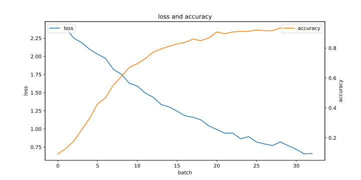 |
| True | 2 * 2 | PCA | | | 2/10 | 1 | 1 | 0.2 | 32次中有：12次完全正确，4次少抓1个，1次多抓1个，4次少抓1个多抓1个，7次少抓2个多抓1个，2次少抓1个多抓2个，2次少抓2个多抓2个 <br/>[((2, 0), 12), ((1, 0), 4), ((2, 1), 1), ((1, 1), 4), ((0, 1), 7), ((1, 2), 2), ((0, 2), 2)] |  | | [准确率](./result/Archive001-oldHistory/Archive007-poolSizeAndPCAorForest/2024.07.08-00:01:53/accuracyList.txt) | 96.2% | 31 | 8:46:32 |  |
| True | 2 * 2 | Isolation Forest |  | [准确率](./result/Archive001-oldHistory/Archive007-poolSizeAndPCAorForest/2024.07.08-04:18:52/accuracyList.txt) | 93.9% | 30 | 8:46:32 |  |
| True | 2 * 2 | PCA | | | 2/10 | 1 | 1 | 0.2 | 32次中有：7次完全正确，4次少抓1个，4次多抓1个，7次少抓1个多抓1个，9次少抓2个多抓1个，1次少抓1个多抓2个 <br/>[((2, 0), 7), ((1, 0), 4), ((2, 1), 4), ((1, 1), 7), ((0, 1), 9), ((1, 2), 1)] |  | | [准确率](./result/Archive001-oldHistory/Archive007-poolSizeAndPCAorForest/2024.07.08-00:10:15/accuracyList.txt) | 95.5% | 32 | 8:46:32 |  |
| True | 2 * 2 | PCA | | | 2/10 | 1 | 1 | 0.2 | 32次中有：8次完全正确，3次少抓1个，5次多抓1个，12次少抓1个多抓1个，4次少抓2个多抓1个 <br/>[((2, 0), 8), ((1, 0), 3), ((2, 1), 5), ((1, 1), 12), ((0, 1), 4)] |  | | [准确率](./result/Archive001-oldHistory/Archive007-poolSizeAndPCAorForest/2024.07.08-00:18:07/accuracyList.txt) | 96.7% | 31 | 8:46:32 | 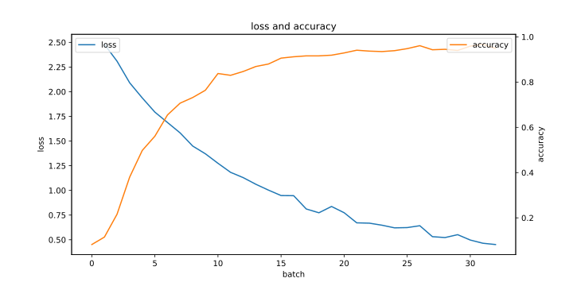 |
| True | 2 * 2 | Isolation Forest | | | 2/10 | 1 | 1 | 0.2 | 32次中有：3次完全正确，5次少抓1个，6次少抓2个，7次少抓1个多抓1个，9次少抓2个多抓1个，1次少抓1个多抓2个，1次少抓2个多抓2个 <br/>[((2, 0), 3), ((1, 0), 5), ((0, 0), 6), ((1, 1), 7), ((0, 1), 9), ((1, 2), 1), ((0, 2), 1)] |  | | [准确率](./result/Archive001-oldHistory/Archive007-poolSizeAndPCAorForest/2024.07.08-04:27:56/accuracyList.txt) | 93.5% | 31 | 8:46:32 |  |
| True | 3 * 3 | Isolation Forest |  | [准确率](./result/Archive001-oldHistory/Archive007-poolSizeAndPCAorForest/2024.07.08-05:00:14/accuracyList.txt) | 94.4% | 29 | 8:46:32 |  |
| True | 3 * 3 | Isolation Forest |  | [准确率](./result/Archive001-oldHistory/Archive007-poolSizeAndPCAorForest/2024.07.08-04:45:55/accuracyList.txt) | 94.2% | 31 | 8:46:32 |  |
| True | 3 * 3 | PCA | | | 2/10 | 1 | 1 | 0.2 | 32次中有：2次完全正确，7次少抓1个，3次多抓1个，10次少抓1个多抓1个，10次少抓2个多抓1个 <br/>[((2, 0), 2), ((1, 0), 7), ((2, 1), 3), ((1, 1), 10), ((0, 1), 10)] |  | | [准确率](./result/Archive001-oldHistory/Archive007-poolSizeAndPCAorForest/2024.07.08-00:25:52/accuracyList.txt) | 95.4% | 27 | 8:46:32 | 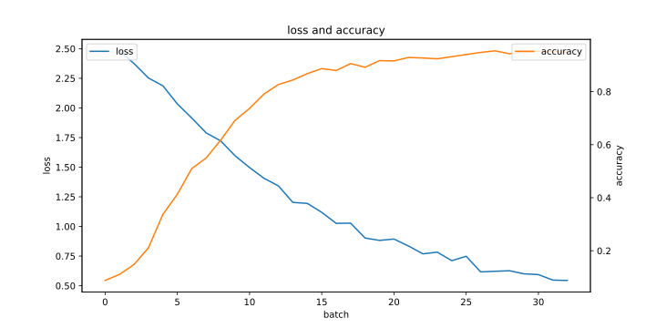 |
| True | 3 * 3 | PCA | | | 2/10 | 1 | 1 | 0.2 | 32次中有：2次完全正确，5次少抓1个，2次多抓1个，7次少抓1个多抓1个，5次少抓2个多抓1个，3次少抓1个多抓2个，8次少抓2个多抓2个 <br/>[((2, 0), 2), ((1, 0), 5), ((2, 1), 2), ((1, 1), 7), ((0, 1), 5), ((1, 2), 3), ((0, 2), 8)] |  | | [准确率](./result/Archive001-oldHistory/Archive007-poolSizeAndPCAorForest/2024.07.08-00:32:31/accuracyList.txt) | 94.7% | 31 | 8:46:32 |  |
| True | 3 * 3 | PCA | | | 2/10 | 1 | 1 | 0.2 | 32次中有：2次完全正确，5次少抓1个，5次多抓1个，4次少抓1个多抓1个，11次少抓2个多抓1个，5次少抓2个多抓2个 <br/>[((2, 0), 2), ((1, 0), 5), ((2, 1), 5), ((1, 1), 4), ((0, 1), 11), ((0, 2), 5)] |  | | [准确率](./result/Archive001-oldHistory/Archive007-poolSizeAndPCAorForest/2024.07.08-00:39:10/accuracyList.txt) | 95.6% | 32 | 8:46:32 | 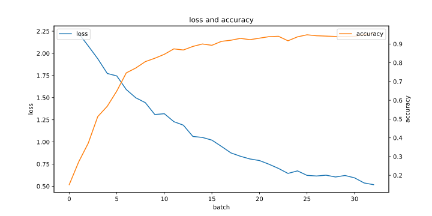 |
| True | 3 * 3 | Isolation Forest |  | [准确率](./result/Archive001-oldHistory/Archive007-poolSizeAndPCAorForest/2024.07.08-04:53:03/accuracyList.txt) | 93.7% | 28 | 8:46:32 | 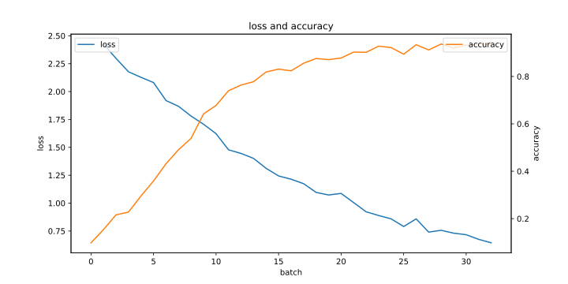 |
| True | 4 * 4 | PCA | | | 2/10 | 1 | 1 | 0.2 | 32次中有：1次完全正确，6次少抓1个，7次少抓1个多抓1个，9次少抓2个多抓1个，4次少抓1个多抓2个，5次少抓2个多抓2个 <br/>[((2, 0), 1), ((1, 0), 6), ((1, 1), 7), ((0, 1), 9), ((1, 2), 4), ((0, 2), 5)] |  | | [准确率](./result/Archive001-oldHistory/Archive007-poolSizeAndPCAorForest/2024.07.08-00:56:47/accuracyList.txt) | 94.9% | 32 | 8:46:32 |  |
| True | 4 * 4 | Isolation Forest |  | [准确率](./result/Archive001-oldHistory/Archive007-poolSizeAndPCAorForest/2024.07.08-05:19:16/accuracyList.txt) | 94.9% | 32 | 8:46:32 |  |
| True | 4 * 4 | Isolation Forest |  | [准确率](./result/Archive001-oldHistory/Archive007-poolSizeAndPCAorForest/2024.07.08-05:07:24/accuracyList.txt) | 93.5% | 31 | 8:46:32 |  |
| True | 4 * 4 | Isolation Forest |  | [准确率](./result/Archive001-oldHistory/Archive007-poolSizeAndPCAorForest/2024.07.08-05:12:58/accuracyList.txt) | 94.8% | 30 | 8:46:32 |  |
| True | 4 * 4 | PCA | | | 2/10 | 1 | 1 | 0.2 | 32次中有：1次完全正确，5次少抓1个，1次多抓1个，6次少抓1个多抓1个，9次少抓2个多抓1个，9次少抓2个多抓2个，1次少抓2个多抓3个 <br/>[((2, 0), 1), ((1, 0), 5), ((2, 1), 1), ((1, 1), 6), ((0, 1), 9), ((0, 2), 9), ((0, 3), 1)] |  | | [准确率](./result/Archive001-oldHistory/Archive007-poolSizeAndPCAorForest/2024.07.08-00:51:22/accuracyList.txt) | 93.2% | 32 | 8:46:32 | 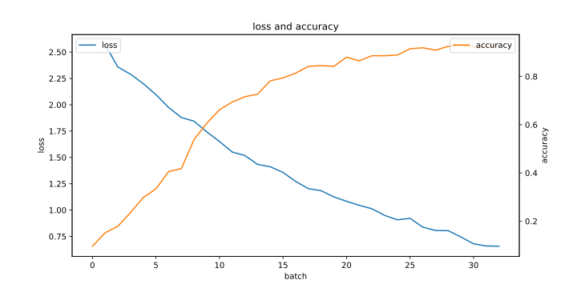 |
| True | 4 * 4 | PCA | | | 2/10 | 1 | 1 | 0.2 | 32次中有：1次完全正确，6次少抓1个，5次少抓1个多抓1个，13次少抓2个多抓1个，2次少抓1个多抓2个，5次少抓2个多抓2个 <br/>[((2, 0), 1), ((1, 0), 6), ((1, 1), 5), ((0, 1), 13), ((1, 2), 2), ((0, 2), 5)] |  | | [准确率](./result/Archive001-oldHistory/Archive007-poolSizeAndPCAorForest/2024.07.08-00:45:55/accuracyList.txt) | 93.9% | 29 | 8:46:32 | 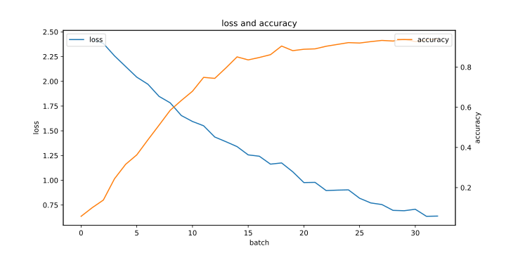 |
| True | 5 * 5 | Isolation Forest |  | [准确率](./result/Archive001-oldHistory/Archive007-poolSizeAndPCAorForest/2024.07.08-05:29:49/accuracyList.txt) | 94.8% | 32 | 8:46:32 |  |
| True | 5 * 5 | Isolation Forest |  | [准确率](./result/Archive001-oldHistory/Archive007-poolSizeAndPCAorForest/2024.07.08-05:24:48/accuracyList.txt) | 94.8% | 30 | 8:46:32 |  |
| True | 5 * 5 | PCA | | | 2/10 | 1 | 1 | 0.2 | 32次中有：1次完全正确，3次少抓1个，5次少抓1个多抓1个，17次少抓2个多抓1个，5次少抓2个多抓2个，1次少抓2个多抓3个 <br/>[((2, 0), 1), ((1, 0), 3), ((1, 1), 5), ((0, 1), 17), ((0, 2), 5), ((0, 3), 1)] |  | | [准确率](./result/Archive001-oldHistory/Archive007-poolSizeAndPCAorForest/2024.07.08-01:07:25/accuracyList.txt) | 94.8% | 31 | 8:46:32 | 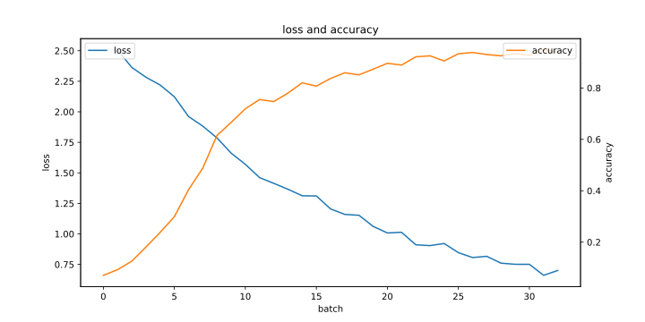 |
| True | 5 * 5 | PCA | | | 2/10 | 1 | 1 | 0.2 | 32次中有：1次完全正确，2次少抓1个，11次少抓1个多抓1个，12次少抓2个多抓1个，2次少抓1个多抓2个，4次少抓2个多抓2个 <br/>[((2, 0), 1), ((1, 0), 2), ((1, 1), 11), ((0, 1), 12), ((1, 2), 2), ((0, 2), 4)] |  | | [准确率](./result/Archive001-oldHistory/Archive007-poolSizeAndPCAorForest/2024.07.08-01:12:38/accuracyList.txt) | 95.4% | 30 | 8:46:32 |  |
| True | 5 * 5 | Isolation Forest |  | [准确率](./result/Archive001-oldHistory/Archive007-poolSizeAndPCAorForest/2024.07.08-05:34:51/accuracyList.txt) | 93.3% | 30 | 8:46:32 | 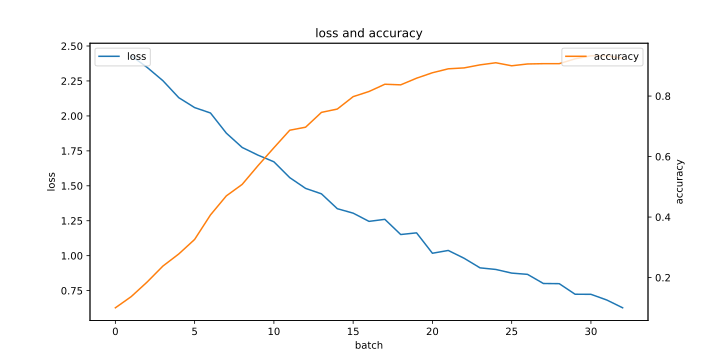 |
| True | 5 * 5 | PCA |  | [准确率](./result/Archive001-oldHistory/Archive007-poolSizeAndPCAorForest/2024.07.08-01:02:13/accuracyList.txt) | 94.6% | 32 | 8:46:32 | 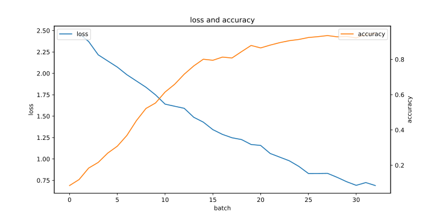 |
| False | 2 * 2 | Isolation Forest | | | 2/10 | 1 | 1 | 0.2 | 32次中有：1次完全正确，1次少抓1个，4次少抓2个，1次多抓1个，7次少抓1个多抓1个，13次少抓2个多抓1个，1次多抓2个，1次少抓1个多抓2个，2次少抓2个多抓2个，1次少抓2个多抓3个 <br/>[((2, 0), 1), ((1, 0), 1), ((0, 0), 4), ((2, 1), 1), ((1, 1), 7), ((0, 1), 13), ((2, 2), 1), ((1, 2), 1), ((0, 2), 2), ((0, 3), 1)] |  | | [准确率](./result/Archive001-oldHistory/Archive007-poolSizeAndPCAorForest/2024.07.08-05:57:10/accuracyList.txt) | 93.8% | 32 | 8:46:32 |  |
| False | 2 * 2 | PCA | | | 2/10 | 1 | 1 | 0.2 | 32次中有：25次完全正确，1次少抓1个，1次多抓1个，3次少抓1个多抓1个，1次少抓2个多抓1个，1次少抓1个多抓2个 <br/>[((2, 0), 25), ((1, 0), 1), ((2, 1), 1), ((1, 1), 3), ((0, 1), 1), ((1, 2), 1)] |  | | [准确率](./result/Archive001-oldHistory/Archive007-poolSizeAndPCAorForest/2024.07.08-01:17:50/accuracyList.txt) | 96.6% | 30 | 8:46:32 | 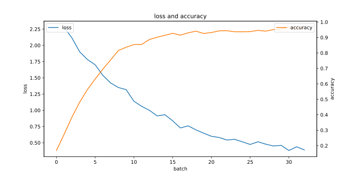 |
| False | 2 * 2 | Isolation Forest |  | [准确率](./result/Archive001-oldHistory/Archive007-poolSizeAndPCAorForest/2024.07.08-06:14:14/accuracyList.txt) | 94.8% | 32 | 8:46:32 |  |
| False | 2 * 2 | PCA | | | 2/10 | 1 | 1 | 0.2 | 32次中有：29次完全正确，1次少抓1个，2次少抓1个多抓1个 <br/>[((2, 0), 29), ((1, 0), 1), ((1, 1), 2)] |  | | [准确率](./result/Archive001-oldHistory/Archive007-poolSizeAndPCAorForest/2024.07.08-01:32:52/accuracyList.txt) | 96.8% | 23 | 8:46:32 | 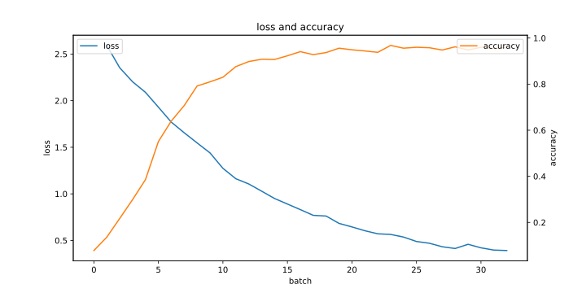 |
| False | 2 * 2 | Isolation Forest | | | 2/10 | 1 | 1 | 0.2 | 32次中有：1次完全正确，4次少抓1个，7次少抓2个，1次少抓1个多抓1个，14次少抓2个多抓1个，3次少抓1个多抓2个，2次少抓2个多抓2个 <br/>[((2, 0), 1), ((1, 0), 4), ((0, 0), 7), ((1, 1), 1), ((0, 1), 14), ((1, 2), 3), ((0, 2), 2)] |  | | [准确率](./result/Archive001-oldHistory/Archive007-poolSizeAndPCAorForest/2024.07.08-05:39:57/accuracyList.txt) | 95.3% | 31 | 8:46:32 | 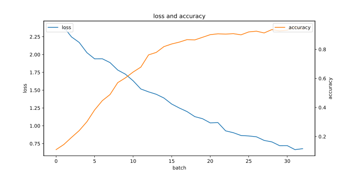 |
| False | 2 * 2 | PCA | | | 2/10 | 1 | 1 | 0.2 | 32次中有：20次完全正确，7次少抓1个，4次少抓1个多抓1个，1次少抓2个多抓1个 <br/>[((2, 0), 20), ((1, 0), 7), ((1, 1), 4), ((0, 1), 1)] |  | | [准确率](./result/Archive001-oldHistory/Archive007-poolSizeAndPCAorForest/2024.07.08-01:47:56/accuracyList.txt) | 96.2% | 28 | 8:46:32 |  |
| False | 3 * 3 | PCA | | | 2/10 | 1 | 1 | 0.2 | 32次中有：25次完全正确，3次少抓1个，1次多抓1个，1次少抓1个多抓1个，1次少抓2个多抓1个，1次少抓2个多抓2个 <br/>[((2, 0), 25), ((1, 0), 3), ((2, 1), 1), ((1, 1), 1), ((0, 1), 1), ((0, 2), 1)] |  | | [准确率](./result/Archive001-oldHistory/Archive007-poolSizeAndPCAorForest/2024.07.08-02:03:01/accuracyList.txt) | 96.5% | 26 | 8:46:32 |  |
| False | 3 * 3 | PCA | | | 2/10 | 1 | 1 | 0.2 | 32次中有：25次完全正确，2次少抓1个，1次少抓1个多抓1个，3次少抓2个多抓1个，1次少抓1个多抓2个 <br/>[((2, 0), 25), ((1, 0), 2), ((1, 1), 1), ((0, 1), 3), ((1, 2), 1)] |  | | [准确率](./result/Archive001-oldHistory/Archive007-poolSizeAndPCAorForest/2024.07.08-02:18:07/accuracyList.txt) | 96.2% | 28 | 8:46:32 |  |
| False | 3 * 3 | Isolation Forest | | | 2/10 | 1 | 1 | 0.2 | 32次中有：2次完全正确，4次少抓1个，7次少抓2个，10次少抓1个多抓1个，7次少抓2个多抓1个，1次少抓1个多抓2个，1次少抓2个多抓2个 <br/>[((2, 0), 2), ((1, 0), 4), ((0, 0), 7), ((1, 1), 10), ((0, 1), 7), ((1, 2), 1), ((0, 2), 1)] |  | | [准确率](./result/Archive001-oldHistory/Archive007-poolSizeAndPCAorForest/2024.07.08-06:48:39/accuracyList.txt) | 94.8% | 32 | 8:46:32 | 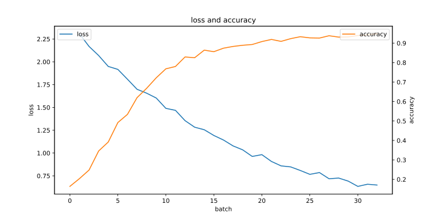 |
| False | 3 * 3 | Isolation Forest | | | 2/10 | 1 | 1 | 0.2 | 32次中有：1次完全正确，11次少抓1个，1次少抓2个，2次多抓1个，3次少抓1个多抓1个，8次少抓2个多抓1个，1次少抓1个多抓2个，5次少抓2个多抓2个 <br/>[((2, 0), 1), ((1, 0), 11), ((0, 0), 1), ((2, 1), 2), ((1, 1), 3), ((0, 1), 8), ((1, 2), 1), ((0, 2), 5)] |  | | [准确率](./result/Archive001-oldHistory/Archive007-poolSizeAndPCAorForest/2024.07.08-06:31:26/accuracyList.txt) | 94.0% | 31 | 8:46:32 |  |
| False | 3 * 3 | Isolation Forest |  | [准确率](./result/Archive001-oldHistory/Archive007-poolSizeAndPCAorForest/2024.07.08-07:05:42/accuracyList.txt) | 94.9% | 32 | 8:46:32 |  |
| False | 3 * 3 | PCA | | | 2/10 | 1 | 1 | 0.2 | 32次中有：25次完全正确，1次少抓1个，1次多抓1个，1次少抓1个多抓1个，4次少抓2个多抓1个 <br/>[((2, 0), 25), ((1, 0), 1), ((2, 1), 1), ((1, 1), 1), ((0, 1), 4)] |  | | [准确率](./result/Archive001-oldHistory/Archive007-poolSizeAndPCAorForest/2024.07.08-02:33:13/accuracyList.txt) | 96.4% | 29 | 8:46:32 |  |
| False | 4 * 4 | PCA | | | 2/10 | 1 | 1 | 0.2 | 32次中有：22次完全正确，2次少抓1个，1次多抓1个，2次少抓1个多抓1个，5次少抓2个多抓1个 <br/>[((2, 0), 22), ((1, 0), 2), ((2, 1), 1), ((1, 1), 2), ((0, 1), 5)] |  | | [准确率](./result/Archive001-oldHistory/Archive007-poolSizeAndPCAorForest/2024.07.08-03:03:19/accuracyList.txt) | 96.1% | 30 | 8:46:32 |  |
| False | 4 * 4 | PCA | | | 2/10 | 1 | 1 | 0.2 | 32次中有：24次完全正确，1次少抓1个，2次多抓1个，2次少抓1个多抓1个，3次少抓2个多抓1个 <br/>[((2, 0), 24), ((1, 0), 1), ((2, 1), 2), ((1, 1), 2), ((0, 1), 3)] |  | | [准确率](./result/Archive001-oldHistory/Archive007-poolSizeAndPCAorForest/2024.07.08-03:18:43/accuracyList.txt) | 96.0% | 27 | 8:46:32 |  |
| False | 4 * 4 | Isolation Forest |  | [准确率](./result/Archive001-oldHistory/Archive007-poolSizeAndPCAorForest/2024.07.08-07:39:54/accuracyList.txt) | 94.0% | 29 | 8:46:32 |  |
| False | 4 * 4 | Isolation Forest | | | 2/10 | 1 | 1 | 0.2 | 32次中有：1次完全正确，6次少抓1个，7次少抓2个，3次少抓1个多抓1个，11次少抓2个多抓1个，3次少抓2个多抓2个，1次少抓2个多抓4个 <br/>[((2, 0), 1), ((1, 0), 6), ((0, 0), 7), ((1, 1), 3), ((0, 1), 11), ((0, 2), 3), ((0, 4), 1)] |  | | [准确率](./result/Archive001-oldHistory/Archive007-poolSizeAndPCAorForest/2024.07.08-07:22:48/accuracyList.txt) | 95.4% | 31 | 8:46:32 | 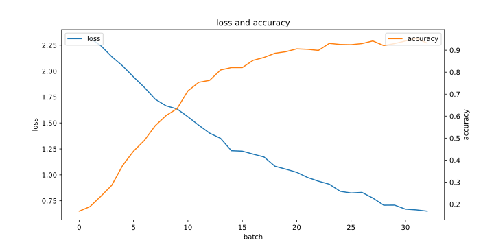 |
| False | 4 * 4 | Isolation Forest | | | 2/10 | 1 | 1 | 0.2 | 32次中有：2次完全正确，6次少抓1个，7次少抓2个，6次少抓1个多抓1个，7次少抓2个多抓1个，4次少抓2个多抓2个 <br/>[((2, 0), 2), ((1, 0), 6), ((0, 0), 7), ((1, 1), 6), ((0, 1), 7), ((0, 2), 4)] |  | | [准确率](./result/Archive001-oldHistory/Archive007-poolSizeAndPCAorForest/2024.07.08-07:57:04/accuracyList.txt) | 93.7% | 30 | 8:46:32 |  |
| False | 4 * 4 | PCA | | | 2/10 | 1 | 1 | 0.2 | 32次中有：25次完全正确，3次少抓1个，1次多抓1个，1次少抓1个多抓1个，2次少抓2个多抓1个 <br/>[((2, 0), 25), ((1, 0), 3), ((2, 1), 1), ((1, 1), 1), ((0, 1), 2)] |  | | [准确率](./result/Archive001-oldHistory/Archive007-poolSizeAndPCAorForest/2024.07.08-02:48:14/accuracyList.txt) | 96.9% | 32 | 8:46:32 |  |
| False | 5 * 5 | PCA | | | 2/10 | 1 | 1 | 0.2 | 32次中有：28次完全正确，2次少抓1个，1次少抓1个多抓1个，1次少抓2个多抓1个 <br/>[((2, 0), 28), ((1, 0), 2), ((1, 1), 1), ((0, 1), 1)] |  | | [准确率](./result/Archive001-oldHistory/Archive007-poolSizeAndPCAorForest/2024.07.08-03:48:48/accuracyList.txt) | 96.4% | 30 | 8:46:32 |  |
| False | 5 * 5 | Isolation Forest |  | [准确率](./result/Archive001-oldHistory/Archive007-poolSizeAndPCAorForest/2024.07.08-08:14:05/accuracyList.txt) | 94.9% | 29 | 8:46:32 |  |
| False | 5 * 5 | Isolation Forest | | | 2/10 | 1 | 1 | 0.2 | 32次中有：2次完全正确，3次少抓1个，8次少抓2个，5次少抓1个多抓1个，13次少抓2个多抓1个，1次少抓2个多抓2个 <br/>[((2, 0), 2), ((1, 0), 3), ((0, 0), 8), ((1, 1), 5), ((0, 1), 13), ((0, 2), 1)] |  | | [准确率](./result/Archive001-oldHistory/Archive007-poolSizeAndPCAorForest/2024.07.08-08:48:25/accuracyList.txt) | 94.3% | 31 | 8:46:32 |  |
| False | 5 * 5 | PCA | | | 2/10 | 1 | 1 | 0.2 | 32次中有：26次完全正确，5次少抓1个，1次少抓1个多抓1个 <br/>[((2, 0), 26), ((1, 0), 5), ((1, 1), 1)] |  | | [准确率](./result/Archive001-oldHistory/Archive007-poolSizeAndPCAorForest/2024.07.08-03:33:42/accuracyList.txt) | 96.3% | 31 | 8:46:32 |  |
| False | 5 * 5 | Isolation Forest | | | 2/10 | 1 | 1 | 0.2 | 32次中有：2次完全正确，8次少抓1个，4次少抓2个，7次少抓1个多抓1个，8次少抓2个多抓1个，3次少抓2个多抓2个 <br/>[((2, 0), 2), ((1, 0), 8), ((0, 0), 4), ((1, 1), 7), ((0, 1), 8), ((0, 2), 3)] |  | | [准确率](./result/Archive001-oldHistory/Archive007-poolSizeAndPCAorForest/2024.07.08-08:31:17/accuracyList.txt) | 94.6% | 31 | 8:46:32 |  |
| False | 5 * 5 | PCA | | | 2/10 | 1 | 1 | 0.2 | 32次中有：28次完全正确，2次多抓1个，1次少抓1个多抓1个，1次少抓2个多抓1个 <br/>[((2, 0), 28), ((2, 1), 2), ((1, 1), 1), ((0, 1), 1)] |  | | [准确率](./result/Archive001-oldHistory/Archive007-poolSizeAndPCAorForest/2024.07.08-04:03:49/accuracyList.txt) | 96.1% | 32 | 8:46:32 | 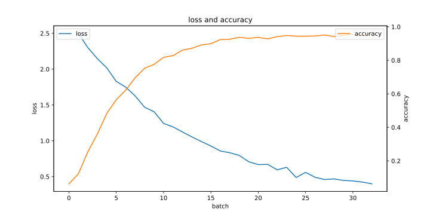 |
```


我知道了，是你的`detection_result`写得不对。

其中一个`detection_result`的结果为`| | 2/10 | 1 | 1 | 0.2 | 32次中有：25次完全正确，3次少抓1个，1次多抓1个，1次少抓1个多抓1个，1次少抓2个多抓1个，1次少抓2个多抓2个 <br/>[((2, 0), 25), ((1, 0), 3), ((2, 1), 1), ((1, 1), 1), ((0, 1), 1), ((0, 2), 1)] |  |`，这里面包含了很多的竖线`|`，因此导致markdown表格错位。我需要的内容只有`32次中有：25次完全正确，3次少抓1个，1次多抓1个，1次少抓1个多抓1个，1次少抓2个多抓1个，1次少抓2个多抓2个 <br/>[((2, 0), 25), ((1, 0), 3), ((2, 1), 1), ((1, 1), 1), ((0, 1), 1), ((0, 2), 1)]`这一部分。


你这根本没改。`line.strip()`还是会有很多额外信息如`| | 2/10 | 1 | 1 | 0.2 | `


你写的还是不正确。现在你只需要解决这么一个简单的问题：

如何从一行字符串：

```
| | 2/10 | 1 | 1 | 0.2 | 32次中有：3次少抓1个，5次少抓2个，6次少抓1个多抓1个，10次少抓2个多抓1个，2次少抓1个多抓2个，4次少抓2个多抓2个，2次少抓2个多抓3个 <br/>[((1, 0), 3), ((0, 0), 5), ((1, 1), 6), ((0, 1), 10), ((1, 2), 2), ((0, 2), 4), ((0, 3), 2)] |  |
```

中提取出

```
32次中有：3次少抓1个，5次少抓2个，6次少抓1个多抓1个，10次少抓2个多抓1个，2次少抓1个多抓2个，4次少抓2个多抓2个，2次少抓2个多抓3个 <br/>[((1, 0), 3), ((0, 0), 5), ((1, 1), 6), ((0, 1), 10), ((1, 2), 2), ((0, 2), 4), ((0, 3), 2)]
```

这一部分。

你只需要返回这个功能相关的代码。


检测结果的问题解决了，当前代码为：

```
import os
import re
from datetime import datetime, timedelta
from typing import List, Tuple, Dict

base_path = './result/Archive001-oldHistory/Archive007-poolSizeAndPCAorForest'

def read_config(file_path: str) -> Dict[str, str]:
    config = {}
    with open(file_path, 'r') as file:
        for line in file:
            if line.strip() and not line.strip().startswith('#'):
                key, value = line.strip().split('=', 1)
                config[key.strip()] = value.strip()
    return config

def get_pool_size_string(pool_size: str) -> str:
    size = int(pool_size)
    return f"{int(size ** 0.5)} * {int(size ** 0.5)}"

def extract_detection_result(line: str) -> str:
    pattern = r'\|\s*\|\s*[^|]*\|\s*[^|]*\|\s*[^|]*\|\s*[^|]*\|\s*([^|]+)\s*\|'
    match = re.search(pattern, line)
    if match:
        return match.group(1).strip()
    else:
        return ""

def extract_accuracies(log_file: str) -> Tuple[List[float], str]:
    accuracies = []
    detection_result = ""
    with open(log_file, 'r') as file:
        lines = file.readlines()
        for line in lines:
            match = re.search(r"Round (\d+)'s accuracy: (\d+\.\d+)%", line)
            if match:
                round_num = int(match.group(1))
                accuracy = float(match.group(2))
                if (round_num, accuracy) not in accuracies:
                    accuracies.append((round_num, accuracy))
        for line in reversed(lines):
            if "次中有：" in line:
                detection_result = line.strip()
                detection_result = extract_detection_result(detection_result)
                break
    accuracies = [accuracy for _, accuracy in sorted(accuracies)]
    return accuracies, detection_result

def get_max_accuracy(accuracies: List[float]) -> Tuple[float, int]:
    max_accuracy = max(accuracies)
    max_round = accuracies.index(max_accuracy) + 1
    return max_accuracy, max_round

def print_summary(config: Dict[str, str], accuracies: List[float], detection_result: str, start_time: str, end_time: str) -> str:
    if_pooling = config.get('ifPooling', 'False')
    pool_size = get_pool_size_string(config.get('poolsize', '1'))
    detection_method = 'PCA' if config.get('ifPCA', 'False') == 'True' else 'Isolation Forest'
    accuracy_link = f"[准确率](./result/Archive001-oldHistory/Archive007-poolSizeAndPCAorForest/{config['folder_name']}/accuracyList.txt)"
    max_accuracy, max_round = get_max_accuracy(accuracies)
    duration = datetime.strptime(end_time, '%Y.%m.%d-%H:%M:%S') - datetime.strptime(start_time, '%Y.%m.%d-%H:%M:%S')
    result_img = f""
    
    detection_result_clean = detection_result.split(" <br/>")[0]

    return f"| {if_pooling} | {pool_size} | {detection_method} | {detection_result_clean} | {accuracy_link} | {max_accuracy}% | {max_round} | {duration} | {result_img} |"

def main():
    date_format = '%Y.%m.%d-%H:%M:%S'
    start_date = datetime.strptime('2024.07.08-00:01:53', date_format)
    end_date = datetime.strptime('2024.07.08-08:48:25', date_format)
    
    folder_names = [f for f in os.listdir(base_path) if os.path.isdir(os.path.join(base_path, f))]
    folder_names = [f for f in folder_names if re.match(r'\d{4}\.\d{2}\.\d{2}-\d{2}:\d{2}:\d{2}$', f)]
    folder_names = [f for f in folder_names if start_date <= datetime.strptime(f[:19], date_format) <= end_date]

    table_header = "| 是否池化 | pool size | 检测方式 | 检测结果 | accuracy | 最大准确率 | 首次出现轮次 | 执行耗时 | 结果图 |\n"
    table_header += "| --- | --- | --- | --- | --- | --- | --- | --- | --- |\n"
    table_rows = []

    for folder_name in folder_names:
        config_path = os.path.join(base_path, folder_name, 'config.env')
        log_path = os.path.join(base_path, folder_name, 'stdout.txt')

        if os.path.exists(config_path) and os.path.exists(log_path):
            config = read_config(config_path)
            config['folder_name'] = folder_name

            accuracies, detection_result = extract_accuracies(log_path)

            with open(os.path.join(base_path, folder_name, 'accuracyList.txt'), 'w') as acc_file:
                acc_file.write("\n".join(map(str, accuracies)))

            start_time = config.get('start_time', start_date.strftime(date_format))
            end_time = config.get('end_time', end_date.strftime(date_format))

            row = print_summary(config, accuracies, detection_result, start_time, end_time)
            table_rows.append(row)
    
    table_rows = sorted(table_rows, key=lambda x: (
        'PCA' not in x,  # 检测方法是PCA的优先
        'True' not in x.split('|')[1],  # ifPooling为True的优先
        int(re.search(r'\d+', x.split('|')[2]).group()),  # pool size小的优先
        x.split('|')[0]  # 文件夹日期小的优先
    ))

    markdown_table = table_header + "\n".join(table_rows)
    print(markdown_table)

if __name__ == "__main__":
    main()
```

但是执行耗时不正确。执行耗时不是总耗时，而是每一行的执行耗时都不同，计算方式为对应stdout.txt中的最大时间减去最小时间。